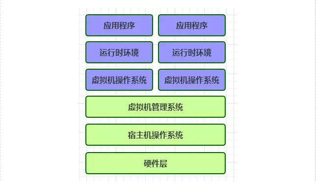
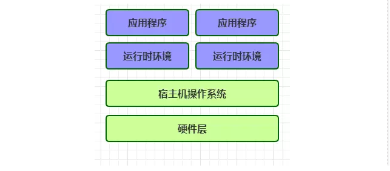
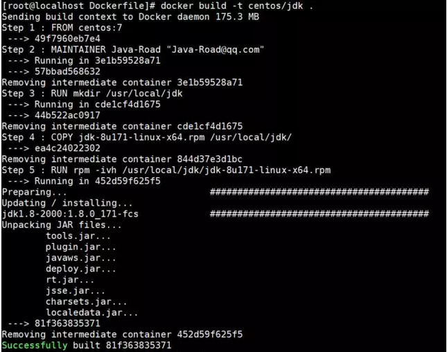

# Docker
## Docker简介
* Docker是开源应用容器引擎，轻量级容器技术。
* 基于Go语言，并遵循Apache2.0协议开源
* Docker可以让开发者打包他们的应用以及依赖包到一个轻量级、可移植的容器中，然后发布到任何流行的Linux系统上，也可以实现虚拟化
* 容器完全使用沙箱技术，相互之间不会有任何接口
* 类似于虚拟机技术(vmware、vitural)，但docker直接运行在操作系统(Linux)上，而不是运行在虚拟机中，速度快，性能开销极低

白话文，简介就是:
```
Docker支持将软件编译成一个镜像，然后在镜像中各种软件做好配置，将镜像发布出去，其他使用者可以直接使用这个镜像。 
运行中的这个镜像称为容器，容器启动是非常快速的。类似windows里面的ghost操 作系统，安装好后什么都有了。
```
## 什么是Docker
Docker 是一个开源的应用容器引擎，基于Go语言，诞生于2013年初，最初发起者是dotCloud公司，开发者可以打包应用到一个轻量级、可移植的容器中，然后发布到主流Linux系统上运行。
为什么用Docker

* 持续交付和部署：使用Docker可以通过定制应用镜像来实现持续集成，持续交付，部署。开发人员构建后的镜像，结合持续集成系统进行集成测试，而运维人员则可以在生产环境中快速部署该镜像，也可以结合持续部署系统进行自动部署。
* 更高效的资源利用：Docker是基于内核级的虚拟化，可以实现更高效的性能，同时对资源的额外需求很低，相比传统虚拟机方式，相同配置的主机能够运行更多的应用。
更轻松的迁移和扩展：Docker容器几乎可以在任何平台上运行，同时支持主流的操作系统发行版本。
* 更快速的启动时间：传统的虚拟机技术启动应用服务往往需要数分钟，而Docker容器应用，由于直接运行于宿主内核，无需启动完整的操作系统，因此可以做到妙级，甚至毫秒级的启动时间，大大的节约了开发，测试，部署的时间。
Docker与传统虚拟机差异

传统虚拟化方式


Docker虚拟化方式



传统虚拟化是在硬件层面实现虚拟化，需要有额外的虚拟机管理应用和虚拟机操作系统层，而Docker容器是在操作系统层面实现虚拟化，直接复用本地主机操作系统，更加轻量级。

## 核心概念

* Docker镜像：类似于虚拟机里的镜像，是一个只读的模板，一个独立的文件系统，使用镜像可以创建容器，可以理解为镜像是容器的基石。
* Docker容器：是由Docker镜像创建的运行实例，类似于轻量级的沙箱，每个容器之间都是相互隔离的。支持的操作有启动，停止，删除等。
* docker客户端(Client)：客户端通过命令行或其他工具使用Docker API(https://docs.docker.com/reference/api/docker_remote_api)与Docker的守护进程进行通信
* docker主机(Host)：一个物理或虚拟的机器用来执行Docker守护进程和容器
* docker仓库(Registry)：Docker仓库用来存储镜像，可以理解为代码控制中的代码仓库，Docker Hub(https://hub.docker.com) 提供了庞大的镜像集合供使用     
## Docker安装及启停
1. 查看centos版本
```
Docker 要求 CentOS 系统的内核版本高于 3.10
通过命令：uname -r
查看当前centos版本，如版本不符，需升级系统版本
```
2. 升级软件包及内核(可选)
```
yum update 
```
3. 安装docker
```
yum install docker
```
4. 启动docker
```
systemctl start docker
```
5. 将docker服务设为开机启动
```
systemtctl enable docker
```
6. 停止docker
```
systemtctl stop docker
```
## Docker常用命令及操作
docker镜像命令
```
docker search mysql  ## 搜索镜像
docker pull mysql ## 下载镜像 下载命名为：docker pull 镜像名:tag，其中tag多为系统的版本，可选的，默认为least
docker images ## 镜像列表 RESPOSITORY为镜像名 TAG为镜像版本，least代表最新 IMAGE_ID 为该镜像唯一ID CREATED 为该镜像创建时间 SIZE 为该镜像大小
docker rmi image-id ##删除指定镜像
docker rmi $(docker images -q) ##删除所有镜像
docker run --name container-name -d image-name ##根据镜像启动容器 -- name：为容器起一个名称
-d：detached，执行完这句命令后，控制台将不会阻塞，可以继续输入命令操作
image-name：要运行的镜像名称
docker ps ##查看运行中容器  CONTAINER ID：启动时生成的ID
IMAGE：该容器使用的镜像
COMMAND：容器启动时执行的命令
CREATED：容器创建时间
STATUS：当前容器状态
PORTS：当前容器所使用的默认端口号
NAMES：启动时给容器设置的名称
docker stop container-name/container-id ## 停止运行中容器
docker ps -a ##查看所有的容器
docker start container-name/container-id ##启动容器
docker rm container-id ## 删除单个容器
docker rm $(docker ps -a -q ) ## 删除所有容器
docker run --name tomcat2 -d -p 8888:8080 tomcat ## 启动做端口映射的容器
docker logs container-id/container-name ##查看容器日志
docker port container-id ## 查看端口映射
docker exec -it container-id/container-name bash  ##容器登录命令为
exit ##容器退出命令
```
[更多命令可以参考](https://docs.docker.com/engine/reference/commandline/docker/ "更多命令可以参考")
## 镜像操作指令

* 获取镜像：
docker pull centos    (默认获取centos最新的镜像)
docker pull centos:7 (获取指定标签镜像)
* 查看本地镜像：
docker images
* 查看镜像详细信息：
docker inspect centos:7 
* 查看镜像历史：
docker history centos:7
* 删除镜像：
A:使用标签删除：docker rmi centos
B:使用ID删除：docker rimi
* 构建镜像：
A:使用docker commit命令
B:使用Dockerfile构建

## 使用docker commit

例：构建一个带有jdk的镜像

按照如下步骤操作
```
[root@localhost ~]# docker run -it centos:7 /bin/bash
[root@060793baf536 /]# yum install wget
[root@060793baf536 /]# wget --no-check-certificate --no-cookies --header "Cookie: oraclelicense=accept-securebackup-cookie" http://download.oracle.com/otn-pub/java/jdk/8u131-b11/d54c1d3a095b4ff2b6607d096fa80163/jdk-8u131-linux-x64.rpm

[root@060793baf536 /]# rpm -ivh jdk-8u131-linux-x64.rpm
Preparing...                          ################################# [100%]
Updating / installing...
   1:jdk1.8.0_131-2000:1.8.0_131-fcs  ################################# [100%]
Unpacking JAR files...
        tools.jar...
        plugin.jar...
        javaws.jar...
        deploy.jar...
        rt.jar...
        jsse.jar...
        charsets.jar...
        localedata.jar...
[root@060793baf536 /]# exit
[root@localhost ~]# docker commit 060793baf536 centos/jdk:2.0
```
通过docker images命令可以看到新增了centos/jdk 标签为2.0的镜像
## 使用Dockerfile构建

实际使用中不推荐使用docker commit构建，应使用更灵活和强大的Dockerfile构建docker镜像，直接举例来认识Dockerfile。

例：构建一个带有jdk的centos7镜像
```
[root@localhost Dockerfile]# mkdir Dockerfile
[root@localhost Dockerfile]# cd Dockerfile
编写Dockerfile：
FROM centos:7
MAINTAINER  Java-Road "Java-Road@qq.com"

RUN mkdir /usr/local/jdk
COPY jdk-8u171-linux-x64.rpm /usr/local/jdk/
RUN rpm -ivh /usr/local/jdk/jdk-8u171-linux-x64.rpm
执行如下指令：
[root@localhost Dockerfile]# docker build -t centos/jdk .
```
运行结果如下：

docker images可以看到新生成的centos/jdk镜像

## 容器操作指令
* 创建启动容器：
```
[root@localhost ~]# docker run centos:7 /bin/echo'hello world'
        容器运行完后直接退出
```
* 交互形式创建启动容器
```
[root@localhost ~]# docker run -it centos:7 /bin/bash
[root@802e3623e566 /]# ps
   PID TTY          TIME CMD
     1 ?        00:00:00 bash
    13 ?        00:00:00 ps
[root@802e3623e566 /]# exit
执行exit才能退出容器
 ```
* 守护状态运行容器
 ```
[root@localhost ~]# docker run -d centos:7 /bin/sh -c "while true; do echo hello world; sleep 1; done"
 ```
* 启动已有的容器：
```
* docker start 容器ID   
```  
例：
[root@localhost ~]# docker start 802e3623e566
 ```
* 停止运行的容器：
```
* docker stop 容器ID
```
例：
[root@localhost ~]# docker stop 802e3623e566
 ```
* 删除容器：
```
[root@localhost ~]# docker stop 89566e38c7fb
[root@localhost ~]# docker rm 89566e38c7fb
 ```
* 进入运行的容器：
```
[root@localhost ~]# docker exec -it cbd8b1f35dcc /bin/bash
 ```
* 导出容器：
```
导出容器cbd8b1f35dcc到centos_test.tar文件
[root@localhost ~]# docker export -o centos_test.tar cbd8b1f35dcc
导出的tar文件可以在其他机器上，通过导入来重新运行
 ```
* 导入容器：
```
把导出的文件centos_test.tar通过docker import导入变成镜像
[root@localhost ~]# docker import centos_test.tar test/centos
通过docker images命令可以看到增加了个test/centos镜像
```
## 实例：制作自己的 Docker 容器
下面我以 [koa-demos](http://www.ruanyifeng.com/blog/2017/08/koa.html)项目为例，介绍怎么写 Dockerfile 文件，实现让用户在 Docker 容器里面运行 Koa 框架。
作为准备工作，请先下载源码。
```
$ git clone https://github.com/ruanyf/koa-demos.git
$ cd koa-demos
```
## Dockerfile 文件

首先，在项目的根目录下，新建一个文本文件.dockerignore，写入下面的内容。
```
.git
node_modules
npm-debug.log
```
上面代码表示，这三个路径要排除，不要打包进入 image 文件。如果你没有路径要排除，这个文件可以不新建。

然后，在项目的根目录下，新建一个文本文件 Dockerfile，写入下面的内容。
```
FROM node:8.4
COPY . /app
WORKDIR /app
RUN npm install --registry=https://registry.npm.taobao.org
EXPOSE 3000
```
上面代码一共五行，含义如下。
* FROM node:8.4：该 image 文件继承官方的 node image，冒号表示标签，这里标签是8.4，即8.4版本的 node。
* COPY . /app：将当前目录下的所有文件（除了.dockerignore排除的路径），都拷贝进入 image 文件的/app目录。
* WORKDIR /app：指定接下来的工作路径为/app。
* RUN npm install：在/app目录下，运行npm install命令安装依赖。注意，安装后所有的依赖，都将打包进入 image 文件。
* EXPOSE 3000：将容器 3000 端口暴露出来， 允许外部连接这个端口。

## 创建 image 文件
有了 Dockerfile 文件以后，就可以使用docker image build命令创建 image 文件了。
```
$ docker image build -t koa-demo .
# 或者
$ docker image build -t koa-demo:0.0.1 .
```
上面代码中，-t参数用来指定 image 文件的名字，后面还可以用冒号指定标签。如果不指定，默认的标签就是latest。最后的那个点表示 Dockerfile 文件所在的路径，上例是当前路径，所以是一个点。

如果运行成功，就可以看到新生成的 image 文件koa-demo了。
```
$ docker image ls
```
## 生成容器
docker container run命令会从 image 文件生成容器。
```
$ docker container run -p 8000:3000 -it koa-demo /bin/bash
# 或者
$ docker container run -p 8000:3000 -it koa-demo:0.0.1 /bin/bash
```
上面命令的各个参数含义如下：

* -p参数：容器的 3000 端口映射到本机的 8000 端口。
* -it参数：容器的 Shell 映射到当前的 Shell，然后你在本机窗口输入的命令，就会传入容器。
* koa-demo:0.0.1：image 文件的名字（如果有标签，还需要提供标签，默认是 latest 标签）。
* /bin/bash：容器启动以后，内部第一个执行的命令。这里是启动 Bash，保证用户可以使用 Shell。

如果一切正常，运行上面的命令以后，就会返回一个命令行提示符。
```
root@66d80f4aaf1e:/app#
```
这表示你已经在容器里面了，返回的提示符就是容器内部的 Shell 提示符。执行下面的命令。
```
root@66d80f4aaf1e:/app# node demos/01.js
```
这时，Koa 框架已经运行起来了。打开本机的浏览器，访问 http://127.0.0.1:8000，网页显示"Not Found"，这是因为这个 demo 没有写路由。

这个例子中，Node 进程运行在 Docker 容器的虚拟环境里面，进程接触到的文件系统和网络接口都是虚拟的，与本机的文件系统和网络接口是隔离的，因此需要定义容器与物理机的端口映射（map）。

现在，在容器的命令行，按下 Ctrl + c 停止 Node 进程，然后按下 Ctrl + d （或者输入 exit）退出容器。此外，也可以用docker container kill终止容器运行。
```
# 在本机的另一个终端窗口，查出容器的 ID
$ docker container ls

# 停止指定的容器运行
$ docker container kill [containerID]
```
容器停止运行之后，并不会消失，用下面的命令删除容器文件。
```
# 查出容器的 ID
$ docker container ls --all

# 删除指定的容器文件
$ docker container rm [containerID]
```
也可以使用docker container run命令的--rm参数，在容器终止运行后自动删除容器文件。
```
$ docker container run --rm -p 8000:3000 -it koa-demo /bin/bash
```
## CMD 命令
上一节的例子里面，容器启动以后，需要手动输入命令node demos/01.js。我们可以把这个命令写在 Dockerfile 里面，这样容器启动以后，这个命令就已经执行了，不用再手动输入了。
```
FROM node:8.4
COPY . /app
WORKDIR /app
RUN npm install --registry=https://registry.npm.taobao.org
EXPOSE 3000
CMD node demos/01.js
```
上面的 Dockerfile 里面，多了最后一行CMD node demos/01.js，它表示容器启动后自动执行node demos/01.js。

你可能会问，RUN命令与CMD命令的区别在哪里？简单说，RUN命令在 image 文件的构建阶段执行，执行结果都会打包进入 image 文件；CMD命令则是在容器启动后执行。另外，一个 Dockerfile 可以包含多个RUN命令，但是只能有一个CMD命令。

注意，指定了CMD命令以后，docker container run命令就不能附加命令了（比如前面的/bin/bash），否则它会覆盖CMD命令。现在，启动容器可以使用下面的命令。
```
$ docker container run --rm -p 8000:3000 -it koa-demo:0.0.1
```
## 发布 image 文件

容器运行成功后，就确认了 image 文件的有效性。这时，我们就可以考虑把 image 文件分享到网上，让其他人使用。
首先，去 hub.docker.com 或 cloud.docker.com 注册一个账户。然后，用下面的命令登录。
```
$ docker login
```
接着，为本地的 image 标注用户名和版本。
```
$ docker image tag [imageName] [username]/[repository]:[tag]
# 实例
$ docker image tag koa-demos:0.0.1 ruanyf/koa-demos:0.0.1
```
也可以不标注用户名，重新构建一下 image 文件。
```
$ docker image build -t [username]/[repository]:[tag] .
```
最后，发布 image 文件。
```
$ docker image push [username]/[repository]:[tag]
```
发布成功以后，登录 hub.docker.com，就可以看到已经发布的 image 文件。

## 其他有用的命令

docker 的主要用法就是上面这些，此外还有几个命令，也非常有用。
1. docker container start
前面的docker container run命令是新建容器，每运行一次，就会新建一个容器。同样的命令运行两次，就会生成两个一模一样的容器文件。如果希望重复使用容器，就要使用docker container start命令，它用来启动已经生成、已经停止运行的容器文件。
```
$ docker container start [containerID]
```
2. docker container stop
前面的docker container kill命令终止容器运行，相当于向容器里面的主进程发出 SIGKILL 信号。而docker container stop命令也是用来终止容器运行，相当于向容器里面的主进程发出 SIGTERM 信号，然后过一段时间再发出 SIGKILL 信号。
```
$ bash container stop [containerID]
```
这两个信号的差别是，应用程序收到 SIGTERM 信号以后，可以自行进行收尾清理工作，但也可以不理会这个信号。如果收到 SIGKILL 信号，就会强行立即终止，那些正在进行中的操作会全部丢失。
3. docker container logs
docker container logs命令用来查看 docker 容器的输出，即容器里面 Shell 的标准输出。如果docker run命令运行容器的时候，没有使用-it参数，就要用这个命令查看输出。
```
$ docker container logs [containerID]
```
4. docker container exec
docker container exec命令用于进入一个正在运行的 docker 容器。如果docker run命令运行容器的时候，没有使用-it参数，就要用这个命令进入容器。一旦进入了容器，就可以在容器的 Shell 执行命令了。
```
$ docker container exec -it [containerID] /bin/bash
```
5. docker container cp
docker container cp命令用于从正在运行的 Docker 容器里面，将文件拷贝到本机。下面是拷贝到当前目录的写法。
```
$ docker container cp [containID]:[/path/to/file] .
```