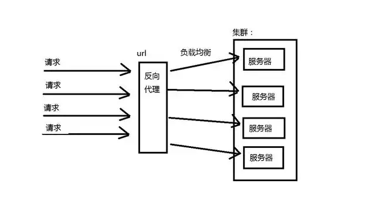
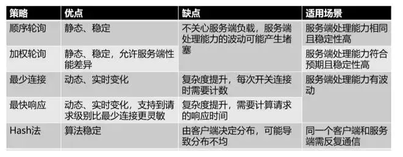

# 集群和负载均衡
在“高并发，海量数据，分布式，NoSql，云计算......”概念满天飞的年代，相信不少朋友都听说过甚至常与人提起“集群，负载均衡”等，

但不是所有人都有机会真正接触到这些技术，也不是所有人都真正理解了这些“听起来很牛的”技术名词。下面简单解释一下吧。

要了解这些概念首先要了解一下项目架构的演进，我这里应用一张Dubbo的文档图片如图

## 一：项目架构的演进

### ORM与MVC：
早期的架构都集中在一台服务器上，这样对于小型的业务访问量是完全可以的，但是随着业务的增多，我们引进的MVC的架构，这种架构是将整个业务分成不同的层（表现层，业务层，数据访问层）维护也更加方面了，开发更加方便。
### PRC架构：
但是业务如果继续增大，项目会出现臃肿，一台服务器已经完全没办法支持了，所以出现了RPC分布式的架构，RPC架构就是将服务进行合理拆分，分别放入多台服务器执行，服务器与服务器之间通过远程调用的方式进行通信。

服务提供者：运行在服务器端，提供服务接口与服务实现类

服务中心：运行在服务器端，负责将本地服务发布成远程服务，管理远程服务，提供服务给消费者使用。

服务消费者：运行在客户端，通过远程代理对象调用远程服务  

### SOA架构：

但是业务继续增加，对RPC架构来说，各个服务与服务之间的通信越来越多，依赖越来越多，越来越混乱，给开发带来了困难，于是SOA架构应运而生，SOA架构将服务与服务集中起来进行管理，加上一个服务治理中心。谁发布了服务来中心进行注册，谁需要依赖什么服务来中心进行请求。

而最近很火的微服务，则是将业务拆分更加精细，每一个可以成为一个完整的服务。演变肯定会演变，但是过程得多久谁也不好说。

## 二：名词解释

接下来进入正题，解释让外行看起来高大上的名词

### 集群(Cluster)
所谓集群是指一组独立的计算机系统构成的一个松耦合的多处理器系统，它们之间通过网络实现进程间的通信。应用程序可以通过网络共享内存进行消息传送，实现分布式计算机。通俗一点来说，就是让若干台计算机联合起来工作(服务)，可以是并行的，也可以是做备份。

大规模集群，通常具备以下一些特点：
1. 高可靠性(HA)

利用集群管理软件，当主服务器故障时，备份服务器能够自动接管主服务器的工作，并及时切换过去，以实现对用户的不间断服务。

2. 高性能计算(HP)

即充分利用集群中的每一台计算机的资源，实现复杂运算的并行处理，通常用于科学计算领域，比如基因分析、化学分析等。

3. 负载平衡(LB)

即把负载压力根据某种算法合理分配到集群中的每一台计算机上，以减轻主服务器的压力，降低对主服务器的硬件和软件要求。

#### 常用的集群又分以下几种
1. load balance cluster(负载均衡集群)
一共有四兄弟开裁缝铺，生意特别多，一个人做不下来，老是延误工期，于是四个兄弟商量：老大接订单, 三个兄弟来干活。 客户多起来之后，老大根据一定的原则(policy) 根据三兄弟手上的工作量来分派新任务。

2. High availability cluster(高可用集群)
两兄弟开早餐铺，生意不大，但是每天早上7点到9点之间客户很多并且不能中断。为了保证2个小时内这个早餐铺能够保证持续提供服务，两兄弟商量几个方法:

方法一：平时老大做生意，老二这个时间段在家等候，一旦老大无法做生意了，老二就出来顶上，这个叫做 Active/Standby.(双机热备)

方法二：平时老大做生意，老二这个时候就在旁边帮工，一旦老大无法做生意，老二就马上顶上，这个叫做Active/Passive.(双机双工)

方法三：平时老大卖包子，老二也在旁边卖豆浆，老大有问题，老二就又卖包子，又卖豆浆，老二不行了，老大就又卖包子，又卖豆浆.这个叫做Active/Active (dual Active)(双机互备)

3. high computing clustering(高性能计算集群)

10个兄弟一起做手工家具生意，一个客户来找他们的老爹要求做一套非常复杂的仿古家具，一个人做也可以做，不过要做很久很久，为了1个星期就交出这一套家具，10个兄弟决定一起做。

老爹把这套家具的不同部分分开交给儿子们作，然后每个儿子都在做木制家具的加工，最后拼在一起叫货。

老爹是scheduler任务调度器，儿子们是compute node. 他们做的工作叫做作业。

### 负载均衡
#### HTTP重定向负载均衡

当用户发来请求的时候，Web服务器通过修改HTTP响应头中的Location标记来返回一个新的url，然后浏览器再继续请求这个新url，实际上就是页面重定向。通过重定向，来达到“负载均衡”的目标。例如，我们在下载JAVA源码包的时候，点击下载链接时，为了解决不同国家和地域下载速度的问题，它会返回一个离我们近的下载地址。重定向的HTTP返回码是302。

优点：比较简单。

缺点：浏览器需要两次请求服务器才能完成一次访问，性能较差。重定向服务自身的处理能力有可能成为瓶颈，整个集群的伸缩性国模有限；使用HTTP302响应码重定向，有可能使搜索引擎判断为SEO作弊，降低搜索排名。

#### DNS域名解析负载均衡

DNS（Domain Name System）负责域名解析的服务，域名url实际上是服务器的别名，实际映射是一个IP地址，解析过程，就是DNS完成域名到IP的映射。而一个域名是可以配置成对应多个IP的。因此，DNS也就可以作为负载均衡服务。

事实上，大型网站总是部分使用DNS域名解析，利用域名解析作为第一级负载均衡手段，即域名解析得到的一组服务器并不是实际提供Web服务的物理服务器，而是同样提供负载均衡服务的内部服务器，这组内部负载均衡服务器再进行负载均衡，将请求分发到真是的Web服务器上。

优点：将负载均衡的工作转交给DNS，省掉了网站管理维护负载均衡服务器的麻烦，同时许多DNS还支持基于地理位置的域名解析，即会将域名解析成举例用户地理最近的一个服务器地址，这样可以加快用户访问速度，改善性能。

缺点：不能自由定义规则，而且变更被映射的IP或者机器故障时很麻烦，还存在DNS生效延迟的问题。而且DNS负载均衡的控制权在域名服务商那里，网站无法对其做更多改善和更强大的管理。

#### 反向代理负载均衡

反向代理服务可以缓存资源以改善网站性能。实际上，在部署位置上，反向代理服务器处于Web服务器前面（这样才可能缓存Web相应，加速访问），这个位置也正好是负载均衡服务器的位置，所以大多数反向代理服务器同时提供负载均衡的功能，管理一组Web服务器，将请求根据负载均衡算法转发到不同的Web服务器上。Web服务器处理完成的响应也需要通过反向代理服务器返回给用户。由于web服务器不直接对外提供访问，因此Web服务器不需要使用外部ip地址，而反向代理服务器则需要配置双网卡和内部外部两套IP地址。

优点：和反向代理服务器功能集成在一起，部署简单。

缺点：反向代理服务器是所有请求和响应的中转站，其性能可能会成为瓶颈。

#### 负载均衡策略

1. 轮询

2. 加权轮询

3. 最少连接数

4. 最快响应

5. Hash法

### 缓存

缓存就是将数据存放在距离计算最近的位置以加快处理速度。缓存是改善软件性能的第一手段，现在CPU越来越快的一个重要因素就是使用了更多的缓存，在复杂的软件设计中，缓存几乎无处不在。大型网站架构设计在很多方面都使用了缓存设计。

#### CDN缓存

内容分发网络，部署在距离终端用户最近的网络服务商，用户的网络请求总是先到达他的网络服务商哪里，在这里缓存网站的一些静态资源（较少变化的数据），可以就近以最快速度返回给用户，如视频网站和门户网站会将用户访问量大的热点内容缓存在CDN中。

#### 反向代理缓存

反向代理属于网站前端架构的一部分，部署在网站的前端，当用户请求到达网站的数据中心时，最先访问到的就是反向代理服务器，这里缓存网站的静态资源，无需将请求继续转发给应用服务器就能返回给用户。加群：698581634 即可免费领取Java架构师学习资料一份

#### 本地缓存

在应用服务器本地缓存着热点数据，应用程序可以在本机内存中直接访问数据，而无需访问数据库。

#### 分布式缓存

大型网站的数据量非常庞大，即使只缓存一小部分，需要的内存空间也不是单机能承受的，所以除了本地缓存，还需要分布式缓存，将数据缓存在一个专门的分布式缓存集群中，应用程序通过网络通信访问缓存数据。

### 流控（流量控制）

#### 流量丢弃

通过单机内存队列来进行有限的等待，直接丢弃用户请求的处理方式显得简单而粗暴，并且如果是I/O密集型应用（包括网络I/O和磁盘I/O），瓶颈一般不再CPU和内存。因此，适当的等待，既能够替身用户体验，又能够提高资源利用率。

通过分布式消息队列来将用户的请求异步化。