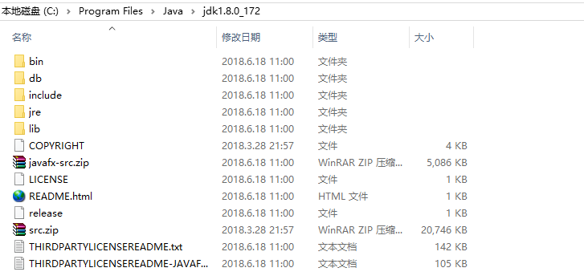
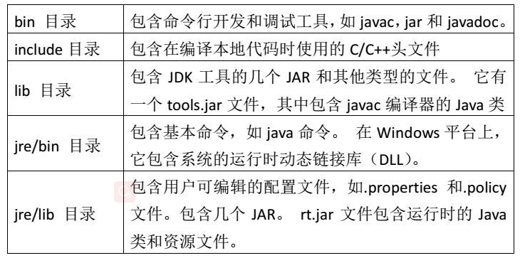
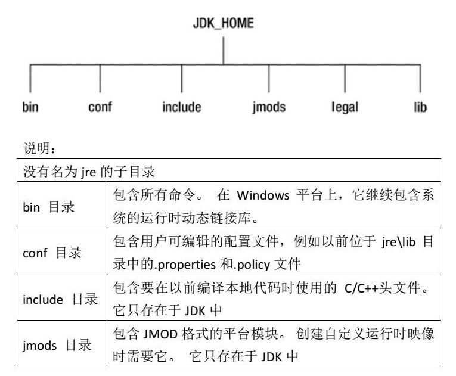
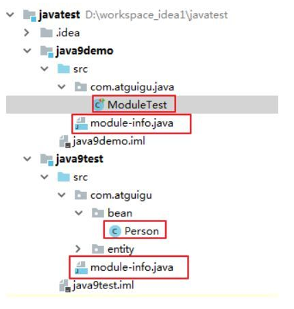
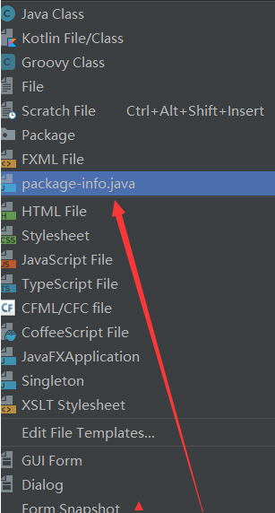
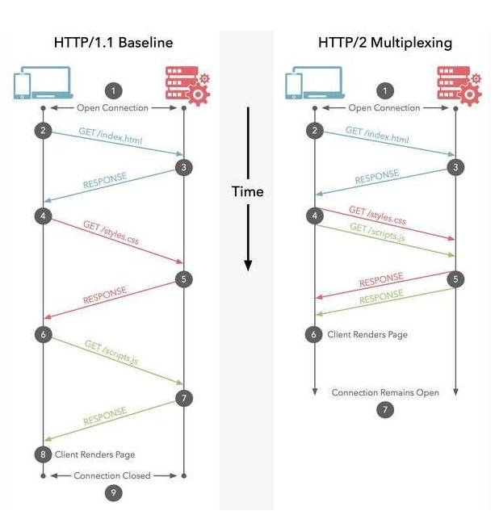

# Java 新特性总结
总结的这些新特性，都是自己觉得在开发中实际用得上的。
简单概括下就是：
* JAVA1.3：普通的原始的JAVA，基本语法相信大家都见过了
* JAVA1.4：assert关键字
* JAVA5：枚举类型、泛型、自动拆装箱
* JAVA6： @Override注解
* JAVA7： <>符号、ARM支持、支持多catch
* JAVA8：Lamda表达式，类型注解等
* JAVA9： 模块化、接口中的私有方法等
## Java5  新特性总结
### 泛型 Generics
 引用泛型之后，允许指定集合里元素的类型，免去了强制类型转换，并且能在编译时刻进行类型检查的好处。Parameterized Type作为参数和返回值，Generic是vararg、annotation、enumeration、collection的基石。

泛型可以带来如下的好处总结如下：

1. 类型安全：抛弃List、Map，使用List、Map给它们添加元素或者使用Iterator遍历时，编译期就可以给你检查出类型错误
2. 方法参数和返回值加上了Type: 抛弃List、Map，使用List、Map
3. 不需要类型转换：List list=new ArrayList();
4. 类型通配符“?”： 假设一个打印List中元素的方法printList,我们希望任何类型T的List都可以被打印
### 枚举类型
引入了枚举类型
### 自动装箱拆箱（自动类型包装和解包）autoboxing & unboxing
简单的说是类型自动转换。自动装包：基本类型自动转为包装类（int ——Integer）自动拆包：包装类自动转为基本类型（Integer——int）
### 可变参数varargs(varargs number of arguments)
参数类型相同时，把重载函数合并到一起了。如：
```java
public void test(object... objs){
    for(Object obj:objs){
        System.out.println(obj);
    }
}
```
### Annotations（重要） 它是java中的metadata（注释）
注解在JAVA5中就引入了。这是非常重要的特性。现在注解的应用已经随处可见。不过JAVA5的注解还不成熟，没法自定义注解。
### 新的迭代语句
```java
for(int n:numbers){
//process
}
```
### 静态导入（import static ）
导入静态对象，可以省略些代码。不过这个也不常用。
```java
import static java.lang.System.out;//导入java.lang包下的System类的静态方法out;
public class HelloWorld{
    public static void main(String[] args){
        out.print("Hello World!");//既是在这里不用再写成System.out.println("Hello World!")了，因为已经导入了这个静态方法out。
    }
}
```
### 新的格式化方法（java.util.Formatter）
```java
formatter.format("Remaining account balance: $%.2f", balance);
```
### 新的线程模型和并发库Thread Framework(重要)
最主要的就是引入了java.util.concurrent包，这个都是需要重点掌握的。

HashMap的替代者ConcurrentHashMap和ArrayList的替代者CopyOnWriteArrayList在大并发量读取时采用java.util.concurrent包里的一些类会让大家满意BlockingQueue、Callable、Executor、Semaphore
## Java6 新特性总结
### Web Services
优先支持编写 XML web service 客户端程序。你可以用过简单的annotaion将你的API发布成.NET交互的web services. Mustang 添加了新的解析和 XML 在 Java object-mapping APIs中, 之前只在Java EE平台实现或者Java Web Services Pack中提供.
### Scripting
现在你可以在Java源代码中混入JavaScript了，这对开发原型很有有用，你也可以插入自己的脚本引擎。
### JDBC4.0
JAVA6将联合绑定 Java DB (Apache Derby). JDBC 4.0 增加了许多特性例如支持XML作为SQL数据类型，更好的集成Binary Large OBjects (BLOBs) 和 Character Large OBjects (CLOBs) .
### UI优化
1. GUI 开发者可以有更多的技巧来使用 SwingWorker utility ，以帮助GUI应用中的多线程。, JTable 分类和过滤，以及添加splash闪屏。
2. Swing拥有更好的 look-and-feel , LCD 文本呈现, 整体GUI性能的提升。Java应用程序可以和本地平台更好的集成，例如访问平台的系统托盘和开始菜单。Mustang将Java插件技术和Java Web Start引擎统一了起来。
### 监控管理增强
添加更多的诊断信息，绑定了不是很知名的 memory-heap 分析工具Jhat 来查看内核导出。
### 编译API
compiler API提供编程访问javac，可以实现进程内编译，动态产生Java代码
### 自定义注解
Java tool和framework 提供商可以定义自己的 annotations ，并且内核支持自定义annotation的插件和执行处理器
### 安全性
XML-数字签名(XML-DSIG) APIs 用于创建和操纵数字签名); 新的方法来访问本地平台的安全服务，例如本地Microsoft Windows for secure authentication and communicationnative 的Public Key Infrastructure (PKI) 和 cryptographic services， Java Generic Security Services (Java GSS) 和 Kerberos services for authentication, 以及访问 LDAP servers 来认证用户.
## Java7 新特性总结
### switch中使用String
java7以前在switch中只能使用number或enum,现在可以使用string了。

示例：
```java
String s = "a";
switch (s) {
    case "a":
        System.out.println("is a");
        break;
    case "b":
        System.out.println("is b");
        break;
    default:
        System.out.println("is c");
        break;
}
```
### 异常处理
* Throwable类增加addSuppressed方法和getSuppressed方法，支持原始异常中加入被抑制的异常。
* 异常抑制：在try和finally中同时抛出异常时，finally中抛出的异常会在异常栈中向上传递，而try中产生的原始异常会消失。
* 在Java7之前的版本，可以将原始异常保存，在finally中产生异常时抛出原始异常：
```java
//java 7 以前
public void read(String filename) throws BaseException {  
    FileInputStream input = null;  
    IOException readException = null;  
    try {  
        input = new FileInputStream(filename);  
    } catch (IOException ex) {  
        readException = ex;   //保存原始异常  
    } finally {  
        if (input != null) {  
            try {  
                input.close();  
            } catch (IOException ex) {  
                if (readException == null) {  
                    readException = ex;  
                }  
            }  
        }  
        if (readException != null) {  
            throw new BaseException(readException);  
        }  
    }  
} 
//在Java7中的版本，可以使用addSuppressed方法记录被抑制的异常：
public void read(String filename) throws IOException {  
    FileInputStream input = null;  
    IOException readException = null;  
    try {  
        input = new FileInputStream(filename);  
    } catch (IOException ex) {  
        readException = ex;  
    } finally {  
        if (input != null) {  
            try {  
                input.close();  
            } catch (IOException ex) {  
                if (readException != null) {    //此处的区别  
                    readException.addSuppressed(ex);  
                }  
                else {  
                    readException = ex;  
                }  
            }  
        }  
        if (readException != null) {  
            throw readException;  
        }  
    }  
}  
```
###  try-with-resources
java7以前对某些资源的操作是需要手动关闭，如InputStream，Writes，Sockets，Sql等，需要在finally中进行关闭资源的操作，现在不需要使用finally来保证打开的流被正确关闭，现在是自动完成的，会自动释放资源,确保每一个资源在处理完成后都会关闭，就不需要我们代码去close();

* 在采用try-with-resources方式后，不需要再次声明流的关闭。
* 可以使用try-with-resources的资源有：任何实现了java.lang.AutoCloseable接口和java.io.Closeable接口的对象。为了支持这个行为，所有可关闭的类将被修改为可以实现一个Closable（可关闭的）接口。
``` java
public interface Closeable extends AutoCloseable{}
public abstract class Reader implements Readable, Closeable{}
```
如果在try语句中写入了没有实现该接口的类，会提示：
```
The resource type File does not implement java.lang.AutoCloseable
```
示例：
```java
//java 7 以前
OutputStream fos = null;
try {
    fos = new FileOutputStream("D:/file");
} finally {
    fos.close();
}
//java 7 以后
try(OutputStream fos = new FileOutputStream("D:/file");){
    // 不需要再次指明fos.close();
}
//try子句中可以管理多个资源
public void copyFile(String fromPath, String toPath) throws IOException {  
try ( InputStream input = new FileInputStream(fromPath);  
    OutputStream output = new FileOutputStream(toPath) ) {  
    byte[] buffer = new byte[8192];  
    int len = -1;  
    while( (len=input.read(buffer))!=-1 ) {  
        output.write(buffer, 0, len);  
        }  
    }   
}  
```
### 捕获多个异常
 java7以前在一个方法抛出多个异常时，只能一个个的catch，这样代码会有多个catch,显得很不友好，现在只需一个catch语句，多个异常类型用"|"隔开。
 示例：
```java
//java 7 以前
try {
    result = field.get(obj);
} catch (IllegalArgumentException e) {
    e.printStackTrace();
} catch (IllegalAccessException e) {
    e.printStackTrace();
}
//java 7 以后
try {
    result = field.get(obj);
} catch (IllegalArgumentException | IllegalAccessException e) {
    e.printStackTrace();
}
```
### 泛型实例化类型自动推断
运用泛型实例化类型自动推断，对通用实例创建(diamond)的type引用进行了改进
示例：
```java
//java 7 以前
List<String> list = new ArrayList<String>();
//java 7 以后
List<String> list = new ArrayList<>();
```
### 增加二进制表示
Java7前支持十进制（123）、八进制（0123）、十六进制（0X12AB）

Java7增加二进制表示（0B11110001、0b11110001）
示例：
```java
int binary = 0b0001_1001;
System.out.println("binary is :"+binary);
                binary is :25
```
### 数字中可添加分隔符
 Java7中支持在数字中间增加'_'作为分隔符，分隔长int以及long（也支持double,float），显示更直观，如（12_123_456）。

下划线只能在数字中间，编译时编译器自动删除数字中的下划线。

示例：
```java
int intOne = 1_000_000;
long longOne = 1_000_000;
double doubleOne = 1_000_000;
float floatOne = 1_000_000;
```
### 变长参数方法的优化
参数类型相同时，把重载函数合并到一起了
使用可变参数时，提升编译器的警告和错误信息
```java
public int sum(int... args) {  
    int result = 0;  
    for (int value : args) {  
        result += value;  
    }  
    return result;  
}  
```
### 集合类的语法支持
```java
//java 7 以前
List<String> list = new ArrayList<String>();
         list.add("item");
         String item = list.get(0);
   
         Set<String> set = new HashSet<String>();
         set.add("item");
         Map<String, Integer> map = new HashMap<String, Integer>();
         map.put("key", 1);
         int value = map.get("key");
//java 7 以后
List<String> list = ["item"];
         String item = list[0];
         
         Set<String> set = {"item"};
         
         Map<String, Integer> map = {"key" : 1};
         int value = map["key"];         
```
### 自动资源管理
Java中某些资源是需要手动关闭的，如InputStream，Writes，Sockets，Sql classes等。这个新的语言特性允许try语句本身申请更多的资源，这些资源作用于try代码块，并自动关闭。
```java
//java 7 以前
BufferedReader br = new BufferedReader(new FileReader(path));
try {
return br.readLine();
    } finally {
        br.close();
} 
//java 7 以后
try (BufferedReader br = new BufferedReader(new FileReader(path)) {
    return br.readLine();
} 
```
### 新增一些取环境信息的工具方法
```java
File System.getJavaIoTempDir() // IO临时文件夹  
File System.getJavaHomeDir() // JRE的安装目录  
File System.getUserHomeDir() // 当前用户目录  
File System.getUserDir() // 启动java进程时所在的目录
```
## Java8 新特性总结
Java8 新增了非常多的特性，我们主要讨论以下几个：
1. Lambda 表达式 − Lambda允许把函数作为一个方法的参数(函数作为参数传递进方法中)。
2. 方法引用 − 方法引用提供了非常有用的语法，可以直接引用已有Java类或对象（实例）的方法或构造器。与lambda联合使用，方法引用可以使语言的构造更紧凑简洁，减少冗余代码。
3. 默认方法 − 默认方法就是一个在接口里面有了一个实现的方法。
4. 新工具 − 新的编译工具，如：Nashorn引擎 jjs、 类依赖分析器jdeps。
5. Stream API −新添加的Stream API（java.util.stream） 把真正的函数式编程风格引入到Java中。
6. Date Time API − 加强对日期与时间的处理。
7. Optional 类 − Optional 类已经成为 Java 8 类库的一部分，用来解决空指针异常。
8. Nashorn, JavaScript 引擎 − Java 8提供了一个新的Nashorn javascript引擎，它允许我们在JVM上运行特定的javascript应用。

### Lambda表达式和函数式接口

Lambda表达式（也称为闭包）是Java 8中最大和最令人期待的语言改变。它允许我们将函数当成参数传递给某个方法，或者把代码本身当作数据处理：函数式开发者非常熟悉这些概念。很多JVM平台上的语言（Groovy、Scala等）从诞生之日就支持Lambda表达式，但是Java开发者没有选择，只能使用匿名内部类代替Lambda表达式。

Lambda的设计耗费了很多时间和很大的社区力量，最终找到一种折中的实现方案，可以实现简洁而紧凑的语言结构。最简单的Lambda表达式可由逗号分隔的参数列表、->符号和语句块组成，例如：
```java
Arrays.asList( "a", "b", "d" ).forEach( e -> System.out.println( e ) );
```
在上面这个代码中的参数e的类型是由编译器推理得出的，你也可以显式指定该参数的类型，例如：
```java
Arrays.asList( "a", "b", "d" ).forEach( ( String e ) -> System.out.println( e ) );
```
如果Lambda表达式需要更复杂的语句块，则可以使用花括号将该语句块括起来，类似于Java中的函数体，例如：
```java
Arrays.asList( "a", "b", "d" ).forEach( e -> {
    System.out.print( e );
    System.out.print( e );
} );
```
Lambda表达式可以引用类成员和局部变量（会将这些变量隐式得转换成final的），例如下列两个代码块的效果完全相同：
```java
String separator = ",";
Arrays.asList( "a", "b", "d" ).forEach( 
    ( String e ) -> System.out.print( e + separator ) );
//和
final String separator = ",";
Arrays.asList( "a", "b", "d" ).forEach( 
    ( String e ) -> System.out.print( e + separator ) );    
```
Lambda表达式有返回值，返回值的类型也由编译器推理得出。如果Lambda表达式中的语句块只有一行，则可以不用使用return语句，下列两个代码片段效果相同：
```java
Arrays.asList( "a", "b", "d" ).sort( ( e1, e2 ) -> e1.compareTo( e2 ) );
//和
Arrays.asList( "a", "b", "d" ).sort( ( e1, e2 ) -> {
    int result = e1.compareTo( e2 );
    return result;
} );
```
Lambda的设计者们为了让现有的功能与Lambda表达式良好兼容，考虑了很多方法，于是产生了函数接口这个概念。函数接口指的是只有一个函数的接口，这样的接口可以隐式转换为Lambda表达式。java.lang.Runnable和java.util.concurrent.Callable是函数式接口的最佳例子。在实践中，函数式接口非常脆弱：只要某个开发者在该接口中添加一个函数，则该接口就不再是函数式接口进而导致编译失败。为了克服这种代码层面的脆弱性，并显式说明某个接口是函数式接口，Java 8 提供了一个特殊的注解@FunctionalInterface（Java 库中的所有相关接口都已经带有这个注解了），举个简单的函数式接口的定义：
```java
@FunctionalInterface
public interface Functional {
    void method();
}
```
不过有一点需要注意，默认方法和静态方法不会破坏函数式接口的定义，因此如下的代码是合法的。
```java
@FunctionalInterface
public interface FunctionalDefaultMethods {
    void method();
 
    default void defaultMethod() {   
        System.out.print("defaultMethod");       
    }        
    static void staticMethod(){
        System.out.print("staticMethod");
    }
}
```
Lambda表达式作为Java 8的最大卖点，它有潜力吸引更多的开发者加入到JVM平台，并在纯Java编程中使用函数式编程的概念。如果你需要了解更多Lambda表达式的细节，可以参考[官方文档](https://docs.oracle.com/javase/tutorial/java/javaOO/lambdaexpressions.html "官方文档")。
### 接口的默认方法和静态方法
Java 8使用两个新概念扩展了接口的含义：默认方法和静态方法。默认方法使得接口有点类似traits，不过要实现的目标不一样。默认方法使得开发者可以在 不破坏二进制兼容性的前提下，往现存接口中添加新的方法，即不强制那些实现了该接口的类也同时实现这个新加的方法。

默认方法和抽象方法之间的区别在于抽象方法需要实现，而默认方法不需要。接口提供的默认方法会被接口的实现类继承或者覆写，例子代码如下：
```java
private interface Defaulable {
    // Interfaces now allow default methods, the implementer may or 
    // may not implement (override) them.
    default String notRequired() { 
        return "Default implementation"; 
    }        
}
 
private static class DefaultableImpl implements Defaulable {
}
 
private static class OverridableImpl implements Defaulable {
    @Override
    public String notRequired() {
        return "Overridden implementation";
    }
}
```
Defaulable接口使用关键字default定义了一个默认方法notRequired()。DefaultableImpl类实现了这个接口，同时默认继承了这个接口中的默认方法；OverridableImpl类也实现了这个接口，但覆写了该接口的默认方法，并提供了一个不同的实现。

Java 8带来的另一个有趣的特性是在接口中可以定义静态方法，例子代码如下：
```java
private interface DefaulableFactory {
    // Interfaces now allow static methods
    static Defaulable create( Supplier< Defaulable > supplier ) {
        return supplier.get();
    }
}
```
下面的代码片段整合了默认方法和静态方法的使用场景：
```java
public static void main( String[] args ) {
    Defaulable defaulable = DefaulableFactory.create( DefaultableImpl::new );
    System.out.println( defaulable.notRequired() );
 
    defaulable = DefaulableFactory.create( OverridableImpl::new );
    System.out.println( defaulable.notRequired() );
}
```
这段代码的输出结果如下：
```
Default implementation
Overridden implementation
```
由于JVM上的默认方法的实现在字节码层面提供了支持，因此效率非常高。默认方法允许在不打破现有继承体系的基础上改进接口。该特性在官方库中的应用是：给java.util.Collection接口添加新方法，如stream()、parallelStream()、forEach()和removeIf()等等。

尽管默认方法有这么多好处，但在实际开发中应该谨慎使用：在复杂的继承体系中，默认方法可能引起歧义和编译错误。如果你想了解更多细节，可以参考[官方文档](https://docs.oracle.com/javase/tutorial/java/IandI/defaultmethods.html "官方文档")。

### 方法引用

方法引用使得开发者可以直接引用现存的方法、Java类的构造方法或者实例对象。方法引用和Lambda表达式配合使用，使得java类的构造方法看起来紧凑而简洁，没有很多复杂的模板代码。

西门的例子中，Car类是不同方法引用的例子，可以帮助读者区分四种类型的方法引用。
```java
public static class Car {
    public static Car create( final Supplier< Car > supplier ) {
        return supplier.get();
    }              
 
    public static void collide( final Car car ) {
        System.out.println( "Collided " + car.toString() );
    }
 
    public void follow( final Car another ) {
        System.out.println( "Following the " + another.toString() );
    }
 
    public void repair() {   
        System.out.println( "Repaired " + this.toString() );
    }
}
```
第一种方法引用的类型是构造器引用，语法是Class::new，或者更一般的形式：Class<T>::new。注意：这个构造器没有参数。
```java
final Car car = Car.create( Car::new );
final List< Car > cars = Arrays.asList( car );
```
第二种方法引用的类型是静态方法引用，语法是Class::static_method。注意：这个方法接受一个Car类型的参数。
```java
cars.forEach( Car::collide );
```
第三种方法引用的类型是某个类的成员方法的引用，语法是Class::method，注意，这个方法没有定义入参：
```java
cars.forEach( Car::repair );
```
第三种方法引用的类型是某个类的成员方法的引用，语法是Class::method，注意，这个方法没有定义入参：
```java
cars.forEach( Car::repair );
```
第四种方法引用的类型是某个实例对象的成员方法的引用，语法是instance::method。注意：这个方法接受一个Car类型的参数：
```java
final Car police = Car.create( Car::new );
cars.forEach( police::follow );
```
运行上述例子，可以在控制台看到如下输出（Car实例可能不同）：
```
Collided com.javacodegeeks.java8.method.references.MethodReferences$Car@7a81197d
Repaired com.javacodegeeks.java8.method.references.MethodReferences$Car@7a81197d
Following the com.javacodegeeks.java8.method.references.MethodReferences$Car@7a81197d
```
如果想了解和学习更详细的内容，可以参考[官方文档](https://docs.oracle.com/javase/tutorial/java/javaOO/methodreferences.html "官方文档")。
### 重复注解
自从Java 5中引入注解以来，这个特性开始变得非常流行，并在各个框架和项目中被广泛使用。不过，注解有一个很大的限制是：在同一个地方不能多次使用同一个注解。Java 8打破了这个限制，引入了重复注解的概念，允许在同一个地方多次使用同一个注解。

在Java 8中使用@Repeatable注解定义重复注解，实际上，这并不是语言层面的改进，而是编译器做的一个trick，底层的技术仍然相同。可以利用下面的代码说明：
```java
package com.javacodegeeks.java8.repeatable.annotations;
 
import java.lang.annotation.ElementType;
import java.lang.annotation.Repeatable;
import java.lang.annotation.Retention;
import java.lang.annotation.RetentionPolicy;
import java.lang.annotation.Target;
 
public class RepeatingAnnotations {
    @Target( ElementType.TYPE )
    @Retention( RetentionPolicy.RUNTIME )
    public @interface Filters {
        Filter[] value();
    }
 
    @Target( ElementType.TYPE )
    @Retention( RetentionPolicy.RUNTIME )
    @Repeatable( Filters.class )
    public @interface Filter {
        String value();
    };
 
    @Filter( "filter1" )
    @Filter( "filter2" )
    public interface Filterable {        
    }
 
    public static void main(String[] args) {
        for( Filter filter: Filterable.class.getAnnotationsByType( Filter.class ) ) {
            System.out.println( filter.value() );
        }
    }
}
```
正如我们所见，这里的Filter类使用@Repeatable(Filters.class)注解修饰，而Filters是存放Filter注解的容器，编译器尽量对开发者屏蔽这些细节。这样，Filterable接口可以用两个Filter注解注释（这里并没有提到任何关于Filters的信息）。

另外，反射API提供了一个新的方法：getAnnotationsByType()，可以返回某个类型的重复注解，例如Filterable.class.getAnnoation(Filters.class)将返回两个Filter实例，输出到控制台的内容如下所示：
```
filter1
filter2
```
如果想了解和学习更详细的内容，可以参考[官方文档](https://docs.oracle.com/javase/tutorial/java/annotations/repeating.html "官方文档")。
### 更好的类型推断
Java 8编译器在类型推断方面有很大的提升，在很多场景下编译器可以推导出某个参数的数据类型，从而使得代码更为简洁。例子代码如下：
```java
package com.javacodegeeks.java8.type.inference;
 
public class Value< T > {
    public static< T > T defaultValue() { 
        return null; 
    }
 
    public T getOrDefault( T value, T defaultValue ) {
        return ( value != null ) ? value : defaultValue;
    }
}
```
下列代码是Value<String>类型的应用：
```java
package com.javacodegeeks.java8.type.inference;
 
public class TypeInference {
    public static void main(String[] args) {
        final Value< String > value = new Value<>();
        value.getOrDefault( "22", Value.defaultValue() );
    }
}
```
参数Value.defaultValue()的类型由编译器推导得出，不需要显式指明。在Java 7中这段代码会有编译错误，除非使用Value.<String>defaultValue()。

### 拓宽注解的应用场景
Java 8拓宽了注解的应用场景。现在，注解几乎可以使用在任何元素上：局部变量、接口类型、超类和接口实现类，甚至可以用在函数的异常定义上。下面是一些例子：
```java
package com.javacodegeeks.java8.annotations;
 
import java.lang.annotation.ElementType;
import java.lang.annotation.Retention;
import java.lang.annotation.RetentionPolicy;
import java.lang.annotation.Target;
import java.util.ArrayList;
import java.util.Collection;
 
public class Annotations {
    @Retention( RetentionPolicy.RUNTIME )
    @Target( { ElementType.TYPE_USE, ElementType.TYPE_PARAMETER } )
    public @interface NonEmpty {        
    }
 
    public static class Holder< @NonEmpty T > extends @NonEmpty Object {
        public void method() throws @NonEmpty Exception {            
        }
    }
 
    @SuppressWarnings( "unused" )
    public static void main(String[] args) {
        final Holder< String > holder = new @NonEmpty Holder< String >();        
        @NonEmpty Collection< @NonEmpty String > strings = new ArrayList<>();        
    }
}
```
ElementType.TYPE_USER和ElementType.TYPE_PARAMETER是Java 8新增的两个注解，用于描述注解的使用场景。Java 语言也做了对应的改变，以识别这些新增的注解。
### Java编译器的新特性
为了在运行时获得Java程序中方法的参数名称，老一辈的Java程序员必须使用不同方法，例如Paranamer library。Java 8终于将这个特性规范化，在语言层面（使用反射API和Parameter.getName()方法）和字节码层面（使用新的javac编译器以及-parameters参数）提供支持。
```java
package com.javacodegeeks.java8.parameter.names;
 
import java.lang.reflect.Method;
import java.lang.reflect.Parameter;
 
public class ParameterNames {
    public static void main(String[] args) throws Exception {
        Method method = ParameterNames.class.getMethod( "main", String[].class );
        for( final Parameter parameter: method.getParameters() ) {
            System.out.println( "Parameter: " + parameter.getName() );
        }
    }
}
```
在Java 8中这个特性是默认关闭的，因此如果不带-parameters参数编译上述代码并运行，则会输出如下结果：
```
Parameter: arg0
```
如果带-parameters参数，则会输出如下结果（正确的结果）：
```
Parameter: args
```
如果你使用Maven进行项目管理，则可以在maven-compiler-plugin编译器的配置项中配置-parameters参数：
```
<plugin>
    <groupId>org.apache.maven.plugins</groupId>
    <artifactId>maven-compiler-plugin</artifactId>
    <version>3.1</version>
    <configuration>
        <compilerArgument>-parameters</compilerArgument>
        <source>1.8</source>
        <target>1.8</target>
    </configuration>
</plugin>
```
### Optional
Java应用中最常见的bug就是空值异常。在Java 8之前，Google Guava引入了Optionals类来解决NullPointerException，从而避免源码被各种null检查污染，以便开发者写出更加整洁的代码。Java 8也将Optional加入了官方库。

Optional仅仅是一个容器：存放T类型的值或者null。它提供了一些有用的接口来避免显式的null检查，可以参考Java 8官方文档了解更多细节。

接下来看一点使用Optional的例子：可能为空的值或者某个类型的值：

```java
Optional< String > fullName = Optional.ofNullable( null );
System.out.println( "Full Name is set? " + fullName.isPresent() );        
System.out.println( "Full Name: " + fullName.orElseGet( () -> "[none]" ) ); 
System.out.println( fullName.map( s -> "Hey " + s + "!" ).orElse( "Hey Stranger!" ) );
```
如果Optional实例持有一个非空值，则isPresent()方法返回true，否则返回false；orElseGet()方法，Optional实例持有null，则可以接受一个lambda表达式生成的默认值；map()方法可以将现有的Opetional实例的值转换成新的值；orElse()方法与orElseGet()方法类似，但是在持有null的时候返回传入的默认值。

上述代码的输出结果如下：
```
Full Name is set? false
Full Name: [none]
Hey Stranger!
```
再看下另一个简单的例子：
```java
Optional< String > firstName = Optional.of( "Tom" );
System.out.println( "First Name is set? " + firstName.isPresent() );        
System.out.println( "First Name: " + firstName.orElseGet( () -> "[none]" ) ); 
System.out.println( firstName.map( s -> "Hey " + s + "!" ).orElse( "Hey Stranger!" ) );
System.out.println();
```
如果想了解和学习更详细的内容，可以参考[官方文档](https://docs.oracle.com/javase/8/docs/api/java/util/Optional.html "官方文档")。
### Streams
新增的Stream API（java.util.stream）将生成环境的函数式编程引入了Java库中。这是目前为止最大的一次对Java库的完善，以便开发者能够写出更加有效、更加简洁和紧凑的代码。

Steam API极大得简化了集合操作（后面我们会看到不止是集合），首先看下这个叫Task的类：

```java
public class Streams  {
    private enum Status {
        OPEN, CLOSED
    };
 
    private static final class Task {
        private final Status status;
        private final Integer points;
 
        Task( final Status status, final Integer points ) {
            this.status = status;
            this.points = points;
        }
 
        public Integer getPoints() {
            return points;
        }
 
        public Status getStatus() {
            return status;
        }
 
        @Override
        public String toString() {
            return String.format( "[%s, %d]", status, points );
        }
    }
}
```
Task类有一个分数（或伪复杂度）的概念，另外还有两种状态：OPEN或者CLOSED。现在假设有一个task集合：
```java
final Collection< Task > tasks = Arrays.asList(
    new Task( Status.OPEN, 5 ),
    new Task( Status.OPEN, 13 ),
    new Task( Status.CLOSED, 8 ) 
);
```
首先看一个问题：在这个task集合中一共有多少个OPEN状态的点？在Java 8之前，要解决这个问题，则需要使用foreach循环遍历task集合；但是在Java 8中可以利用steams解决：包括一系列元素的列表，并且支持顺序和并行处理。
```java
// Calculate total points of all active tasks using sum()
final long totalPointsOfOpenTasks = tasks
    .stream()
    .filter( task -> task.getStatus() == Status.OPEN )
    .mapToInt( Task::getPoints )
    .sum();
 
System.out.println( "Total points: " + totalPointsOfOpenTasks );
```
运行这个方法的控制台输出是：
```
Total points: 18
```
这里有很多知识点值得说。首先，tasks集合被转换成steam表示；其次，在steam上的filter操作会过滤掉所有CLOSED的task；第三，mapToInt操作基于每个task实例的Task::getPoints方法将task流转换成Integer集合；最后，通过sum方法计算总和，得出最后的结果。

在学习下一个例子之前，还需要记住一些steams（[点此更多细节](https://docs.oracle.com/javase/8/docs/api/java/util/Optional.html "点此更多细节")）的知识点。Steam之上的操作可分为中间操作和晚期操作。

中间操作会返回一个新的steam——执行一个中间操作（例如filter）并不会执行实际的过滤操作，而是创建一个新的steam，并将原steam中符合条件的元素放入新创建的steam。

晚期操作（例如forEach或者sum），会遍历steam并得出结果或者附带结果；在执行晚期操作之后，steam处理线已经处理完毕，就不能使用了。在几乎所有情况下，晚期操作都是立刻对steam进行遍历。

steam的另一个价值是创造性地支持并行处理（parallel processing）。对于上述的tasks集合，我们可以用下面的代码计算所有任务的点数之和：
```java
// Calculate total points of all tasks
final double totalPoints = tasks
   .stream()
   .parallel()
   .map( task -> task.getPoints() ) // or map( Task::getPoints ) 
   .reduce( 0, Integer::sum );
 
System.out.println( "Total points (all tasks): " + totalPoints );
```
这里我们使用parallel方法并行处理所有的task，并使用reduce方法计算最终的结果。控制台输出如下：
```
Total points（all tasks）: 26.0
```
对于一个集合，经常需要根据某些条件对其中的元素分组。利用steam提供的API可以很快完成这类任务，代码如下：
```java
// Group tasks by their status
final Map< Status, List< Task > > map = tasks
    .stream()
    .collect( Collectors.groupingBy( Task::getStatus ) );
System.out.println( map );
```
控制台的输出如下：
```
{CLOSED=[[CLOSED, 8]], OPEN=[[OPEN, 5], [OPEN, 13]]}
```
最后一个关于tasks集合的例子问题是：如何计算集合中每个任务的点数在集合中所占的比重，具体处理的代码如下：
```java
// Calculate the weight of each tasks (as percent of total points) 
final Collection< String > result = tasks
    .stream()                                        // Stream< String >
    .mapToInt( Task::getPoints )                     // IntStream
    .asLongStream()                                  // LongStream
    .mapToDouble( points -> points / totalPoints )   // DoubleStream
    .boxed()                                         // Stream< Double >
    .mapToLong( weigth -> ( long )( weigth * 100 ) ) // LongStream
    .mapToObj( percentage -> percentage + "%" )      // Stream< String> 
    .collect( Collectors.toList() );                 // List< String > 
 
System.out.println( result );
```
控制台输出结果如下：
```
[19%, 50%, 30%]
```
最后，正如之前所说，Steam API不仅可以作用于Java集合，传统的IO操作（从文件或者网络一行一行得读取数据）可以受益于steam处理，这里有一个小例子：
```java
final Path path = new File( filename ).toPath();
try( Stream< String > lines = Files.lines( path, StandardCharsets.UTF_8 ) ) {
    lines.onClose( () -> System.out.println("Done!") ).forEach( System.out::println );
}
```
Stream的方法onClose 返回一个等价的有额外句柄的Stream，当Stream的close（）方法被调用的时候这个句柄会被执行。Stream API、Lambda表达式还有接口默认方法和静态方法支持的方法引用，是Java 8对软件开发的现代范式的响应。

[点此更多细节](https://docs.oracle.com/javase/8/docs/api/java/util/stream/package-summary.html "点此更多细节")

### Date/Time API(JSR 310)
Java 8引入了新的Date-Time API(JSR 310)来改进时间、日期的处理。时间和日期的管理一直是最令Java开发者痛苦的问题。java.util.Date和后来的java.util.Calendar一直没有解决这个问题（甚至令开发者更加迷茫）。

因为上面这些原因，诞生了第三方库Joda-Time，可以替代Java的时间管理API。Java 8中新的时间和日期管理API深受Joda-Time影响，并吸收了很多Joda-Time的精华。新的java.time包包含了所有关于日期、时间、时区、Instant（跟日期类似但是精确到纳秒）、duration（持续时间）和时钟操作的类。新设计的API认真考虑了这些类的不变性（从java.util.Calendar吸取的教训），如果某个实例需要修改，则返回一个新的对象。

我们接下来看看java.time包中的关键类和各自的使用例子。首先，Clock类使用时区来返回当前的纳秒时间和日期。Clock可以替代System.currentTimeMillis()和TimeZone.getDefault()。

```java
// Get the system clock as UTC offset 
final Clock clock = Clock.systemUTC();
System.out.println( clock.instant() );
System.out.println( clock.millis() );
```
这个例子的输出结果是：
```
2014-04-12T15:19:29.282Z
1397315969360
```
第二，关注下LocalDate和LocalTime类。LocalDate仅仅包含ISO-8601日历系统中的日期部分；LocalTime则仅仅包含该日历系统中的时间部分。这两个类的对象都可以使用Clock对象构建得到。
```java
// Get the local date and local time
final LocalDate date = LocalDate.now();
final LocalDate dateFromClock = LocalDate.now( clock );
 
System.out.println( date );
System.out.println( dateFromClock );
 
// Get the local date and local time
final LocalTime time = LocalTime.now();
final LocalTime timeFromClock = LocalTime.now( clock );
 
System.out.println( time );
System.out.println( timeFromClock );
```
上述例子的输出结果如下：
```
2014-04-12
2014-04-12
11:25:54.568
15:25:54.568
```
LocalDateTime类包含了LocalDate和LocalTime的信息，但是不包含ISO-8601日历系统中的时区信息。这里有一些关于LocalDate和LocalTime的例子：
```java
// Get the local date/time
final LocalDateTime datetime = LocalDateTime.now();
final LocalDateTime datetimeFromClock = LocalDateTime.now( clock );
 
System.out.println( datetime );
System.out.println( datetimeFromClock );
```
上述这个例子的输出结果如下：
```
2014-04-12T11:37:52.309
2014-04-12T15:37:52.309
```
如果你需要特定时区的data/time信息，则可以使用ZoneDateTime，它保存有ISO-8601日期系统的日期和时间，而且有时区信息。下面是一些使用不同时区的例子：
```java
// Get the zoned date/time
final ZonedDateTime zonedDatetime = ZonedDateTime.now();
final ZonedDateTime zonedDatetimeFromClock = ZonedDateTime.now( clock );
final ZonedDateTime zonedDatetimeFromZone = ZonedDateTime.now( ZoneId.of( "America/Los_Angeles" ) );
 
System.out.println( zonedDatetime );
System.out.println( zonedDatetimeFromClock );
System.out.println( zonedDatetimeFromZone );
```
这个例子的输出结果是：
```
2014-04-12T11:47:01.017-04:00[America/New_York]
2014-04-12T15:47:01.017Z
2014-04-12T08:47:01.017-07:00[America/Los_Angeles]
```
最后看下Duration类，它持有的时间精确到秒和纳秒。这使得我们可以很容易得计算两个日期之间的不同，例子代码如下：
```java
// Get duration between two dates
final LocalDateTime from = LocalDateTime.of( 2014, Month.APRIL, 16, 0, 0, 0 );
final LocalDateTime to = LocalDateTime.of( 2015, Month.APRIL, 16, 23, 59, 59 );
 
final Duration duration = Duration.between( from, to );
System.out.println( "Duration in days: " + duration.toDays() );
System.out.println( "Duration in hours: " + duration.toHours() );
```
这个例子用于计算2014年4月16日和2015年4月16日之间的天数和小时数，输出结果如下：
```
Duration in days: 365
Duration in hours: 8783
```
对于Java 8的新日期时间的总体印象还是比较积极的，一部分是因为Joda-Time的积极影响，另一部分是因为官方终于听取了开发人员的需求。如果想了解和学习更详细的内容，可以参考[官方文档](https://docs.oracle.com/javase/tutorial/datetime/index.html "官方文档")。
###  Nashorn JavaScript引擎
Java 8提供了新的Nashorn JavaScript引擎，使得我们可以在JVM上开发和运行JS应用。Nashorn JavaScript引擎是javax.script.ScriptEngine的另一个实现版本，这类Script引擎遵循相同的规则，允许Java和JavaScript交互使用，例子代码如下：
```java
ScriptEngineManager manager = new ScriptEngineManager();
ScriptEngine engine = manager.getEngineByName( "JavaScript" );
 
System.out.println( engine.getClass().getName() );
System.out.println( "Result:" + engine.eval( "function f() { return 1; }; f() + 1;" ) );
```
这个代码的输出结果如下：
```
jdk.nashorn.api.scripting.NashornScriptEngine
Result: 2
```
### Base64
对Base64编码的支持已经被加入到Java 8官方库中，这样不需要使用第三方库就可以进行Base64编码，例子代码如下：

```java
package com.javacodegeeks.java8.base64;
 
import java.nio.charset.StandardCharsets;
import java.util.Base64;
 
public class Base64s {
    public static void main(String[] args) {
        final String text = "Base64 finally in Java 8!";
 
        final String encoded = Base64
            .getEncoder()
            .encodeToString( text.getBytes( StandardCharsets.UTF_8 ) );
        System.out.println( encoded );
 
        final String decoded = new String( 
            Base64.getDecoder().decode( encoded ),
            StandardCharsets.UTF_8 );
        System.out.println( decoded );
    }
}
```
这个例子的输出结果如下：
```
QmFzZTY0IGZpbmFsbHkgaW4gSmF2YSA4IQ==
Base64 finally in Java 8!
```
新的Base64API也支持URL和MINE的编码解码。
(Base64.getUrlEncoder() / Base64.getUrlDecoder(), Base64.getMimeEncoder() / Base64.getMimeDecoder())。
###  并行数组
Java8版本新增了很多新的方法，用于支持并行数组处理。最重要的方法是parallelSort()，可以显著加快多核机器上的数组排序。下面的例子论证了parallexXxx系列的方法：
```java
package com.javacodegeeks.java8.parallel.arrays;
 
import java.util.Arrays;
import java.util.concurrent.ThreadLocalRandom;
 
public class ParallelArrays {
    public static void main( String[] args ) {
        long[] arrayOfLong = new long [ 20000 ];        
 
        Arrays.parallelSetAll( arrayOfLong, 
            index -> ThreadLocalRandom.current().nextInt( 1000000 ) );
        Arrays.stream( arrayOfLong ).limit( 10 ).forEach( 
            i -> System.out.print( i + " " ) );
        System.out.println();
 
        Arrays.parallelSort( arrayOfLong );        
        Arrays.stream( arrayOfLong ).limit( 10 ).forEach( 
            i -> System.out.print( i + " " ) );
        System.out.println();
    }
}
```
上述这些代码使用parallelSetAll()方法生成20000个随机数，然后使用parallelSort()方法进行排序。这个程序会输出乱序数组和排序数组的前10个元素。上述例子的代码输出的结果是：
```
Unsorted: 591217 891976 443951 424479 766825 351964 242997 642839 119108 552378 
Sorted: 39 220 263 268 325 607 655 678 723 793
```
### 并发性
基于新增的lambda表达式和steam特性，为Java 8中为java.util.concurrent.ConcurrentHashMap类添加了新的方法来支持聚焦操作；另外，也为java.util.concurrentForkJoinPool类添加了新的方法来支持通用线程池操作

Java 8还添加了新的java.util.concurrent.locks.StampedLock类，用于支持基于容量的锁——该锁有三个模型用于支持读写操作（可以把这个锁当做是java.util.concurrent.locks.ReadWriteLock的替代者）。

在java.util.concurrent.atomic包中也新增了不少工具类，列举如下：

1. DoubleAccumulator
2. DoubleAdder
3. LongAccumulator
4. LongAdder
###  新的Java工具
#### Nashorn引擎：jjs

jjs是一个基于标准Nashorn引擎的命令行工具，可以接受js源码并执行。例如，我们写一个func.js文件，内容如下：
```javascript
function f() { 
     return 1; 
}; 
 
print( f() + 1 );
```
可以在命令行中执行这个命令：jjs func.js，控制台输出结果是：
```
2
```
如果需要了解细节，可以参考[官方文档](https://docs.oracle.com/javase/8/docs/technotes/tools/unix/jjs.html "官方文档")。

#### 类依赖分析器：jdeps
jdeps是一个相当棒的命令行工具，它可以展示包层级和类层级的Java类依赖关系，它以.class文件、目录或者Jar文件为输入，然后会把依赖关系输出到控制台。

我们可以利用jedps分析下Spring Framework库，为了让结果少一点，仅仅分析一个JAR文件：org.springframework.core-3.0.5.RELEASE.jar。

```java
jdeps org.springframework.core-3.0.5.RELEASE.jar
```
这个命令会输出很多结果，我们仅看下其中的一部分：依赖关系按照包分组，如果在classpath上找不到依赖，则显示"not found".
```
org.springframework.core-3.0.5.RELEASE.jar -> C:\Program Files\Java\jdk1.8.0\jre\lib\rt.jar
   org.springframework.core (org.springframework.core-3.0.5.RELEASE.jar)
      -> java.io                                            
      -> java.lang                                          
      -> java.lang.annotation                               
      -> java.lang.ref                                      
      -> java.lang.reflect                                  
      -> java.util                                          
      -> java.util.concurrent                               
      -> org.apache.commons.logging                         not found
      -> org.springframework.asm                            not found
      -> org.springframework.asm.commons                    not found
   org.springframework.core.annotation (org.springframework.core-3.0.5.RELEASE.jar)
      -> java.lang                                          
      -> java.lang.annotation                               
      -> java.lang.reflect                                  
      -> java.util
```
如果需要了解细节，可以参考[官方文档](https://docs.oracle.com/javase/8/docs/technotes/tools/unix/jdeps.html "官方文档")。
### JVM的新特性
使用Metaspace（JEP 122）代替持久代（PermGen space）。在JVM参数方面，使用-XX:MetaSpaceSize和-XX:MaxMetaspaceSize代替原来的-XX:PermSize和-XX:MaxPermSize。

## Java 9 新特性总结
1. 模块系统：模块是一个包的容器，Java 9 最大的变化之一是引入了模块系统（Jigsaw 项目）。
2. REPL (JShell)：交互式编程环境。
3. HTTP 2 客户端：HTTP/2标准是HTTP协议的最新版本，新的 HTTPClient API 支持 WebSocket 和 HTTP2 流以及服务器推送特性。
4. 改进的 Javadoc：Javadoc 现在支持在 API 文档中的进行搜索。另外，Javadoc 的输出现在符合兼容 HTML5 标准。
5. 多版本兼容 JAR 包：多版本兼容 JAR 功能能让你创建仅在特定版本的 Java 环境中运行库程序时选择使用的 class 版本。
6. 集合工厂方法：List，Set 和 Map 接口中，新的静态工厂方法可以创建这些集合的不可变实例。
7. 私有接口方法：在接口中使用private私有方法。我们可以使用 private 访问修饰符在接口中编写私有方法。
8. 进程 API: 改进的 API 来控制和管理操作系统进程。引进 java.lang.ProcessHandle 及其嵌套接口 Info 来让开发者逃离时常因为要获取一个本地进程的 PID 而不得不使用本地代码的窘境。
9. 改进的 Stream API：改进的 Stream API 添加了一些便利的方法，使流处理更容易，并使用收集器编写复杂的查询。
10. 改进 try-with-resources：如果你已经有一个资源是 final 或等效于 final 变量,您可以在 try-with-resources 语句中使用该变量，而无需在 try-with-resources 语句中声明一个新变量。
11. 改进的弃用注解 @Deprecated：注解 @Deprecated 可以标记 Java API 状态，可以表示被标记的 API 将会被移除，或者已经破坏。
12. 改进钻石操作符(Diamond Operator) ：匿名类可以使用钻石操作符(Diamond Operator)。
13. 改进 Optional 类：java.util.Optional 添加了很多新的有用方法，Optional 可以直接转为 stream。
14. 多分辨率图像 API：定义多分辨率图像API，开发者可以很容易的操作和展示不同分辨率的图像了。
15. 改进的 CompletableFuture API ： CompletableFuture 类的异步机制可以在 ProcessHandle.onExit 方法退出时执行操作。
16. 轻量级的 JSON API：内置了一个轻量级的JSON API
17. 响应式流（Reactive Streams) API: Java 9中引入了新的响应式流 API 来支持 Java 9 中的响应式编程。

### Java9 新特性之---目录结构
包含jdk8及以前的jdk版本，所有目录结构以及目录含义如图：


jdk9之后，目录结构发生变化如图：

这个新特性只要了解下就可以了，这个目录结构是方便为了接下来新特性做保证
### 模块化
一个大型的项目，比如淘宝商城等，都会包含多个模块，比如订单模块，前台模块，后台管理模块，广告位模块，会员模块.....等等，各个模块之间会相互调用，不过这种情况下会很少，只针对特殊情况，如果一个项目有30个模块系统进行开发，但是只要某个单独模块运行时，都会带动所有的模块，这样对于jvm来说在内存和性能上会很低，所以，java9提供了这一个特性，某一个模块运行的时候，jvm只会启动和它有依赖的模块，并不会加载所有的模块到内存中，这样性能大大的提高了。写法上如下：


一个项目中的两个模块，模块之间通过module-info.java来关联，在IDEA编辑器右键创建package-info.java

在这个两个模块java9Demo和java9Test中，java9demo编写一个实体类Person,在java9Test调用这样一个过程

这个是java9Demo 将 java9Test 模块需要的文件导出 exports 把它所在的包导出
```java
module java9Demo{
    requires com.mdxl.layer_cj.entity;
}
```
然后在java9Test模块中创建一个package-info.java,引入java9Demo模块导出包名
```java
module java9Test{
    requires java9Demo;
}
```
这样就可以直接在java9Test中引入Person实体类了，这只是一个简单的例子。exports 控制着那些包可以被模块访问，所以不被导出的包不能被其他模块访问

### JShell工具
怎么理解，怎么用呢？这个只是针对于java9来说，相当于cmd工具，你可以和cmd一样，直接写方法等等，不过我认为只是适用于初学者做一些最简单的运算和写一些方法：
在cmd中打开这个工具：
```java
$ jshell
|  Welcome to JShell -- Version 9-ea
|  For an introduction type: /help intro
jshell>
```
查看 JShell 命令

输入 /help 可以查看 JShell相关的命令：
``` jshell
jshell> /help
|  Type a Java language expression, statement, or declaration.
|  Or type one of the following commands:
|  /list [<name or id>|-all|-start]
|  list the source you have typed
|  /edit <name or id>
|  edit a source entry referenced by name or id
|  /drop <name or id>
|  delete a source entry referenced by name or id
|  /save [-all|-history|-start] <file>
|  Save snippet source to a file.
|  /open <file>
|  open a file as source input
|  /vars [<name or id>|-all|-start]
|  list the declared variables and their values
|  /methods [<name or id>|-all|-start]
|  list the declared methods and their signatures
|  /types [<name or id>|-all|-start]
|  list the declared types
|  /imports 
|  list the imported items
```
执行 JShell 命令

/imports 命令用于查看已导入的包：
```jshell
jshell> /imports
|    import java.io.*
|    import java.math.*
|    import java.net.*
|    import java.nio.file.*
|    import java.util.*
|    import java.util.concurrent.*
|    import java.util.function.*
|    import java.util.prefs.*
|    import java.util.regex.*
|    import java.util.stream.*
jshell>
```
等等，我认为只适用于初学者学习java不用其他编辑工具就可以学习java
### HTTP 2 客户端
JDK9之前提供HttpURLConnection API来实现Http访问功能，但是这个类基本很少使用，一般都会选择Apache的Http Client，此次在Java 9的版本中引入了一个新的package:java.net.http，里面提供了对Http访问很好的支持，不仅支持Http1.1而且还支持HTTP2（什么是HTTP2？请参见HTTP2的时代来了...），以及WebSocket，据说性能特别好。


注意：新的 HttpClient API 在 Java 9 中以所谓的孵化器模块交付。也就是说，这套 API 不能保证 100% 完成。

### 改进 Javadoc
javadoc 工具可以生成 Java 文档， Java 9 的 javadoc 的输出现在符合兼容 HTML5 标准。
```java
//java 9 之前
C:\JAVA>javadoc -d C:/JAVA Tester.java
//java 9 之后
C:\JAVA> javadoc -d C:/JAVA -html5 Tester.java
```
### 多版本兼容 jar 包
多版本兼容 JAR 功能能让你创建仅在特定版本的 Java 环境中运行库程序时选择使用的 class 版本。

通过 --release 参数指定编译版本。

具体的变化就是 META-INF 目录下 MANIFEST.MF 文件新增了一个属性：
```
Multi-Release: true
```
然后 META-INF 目录下还新增了一个 versions 目录，如果是要支持 java9，则在 versions 目录下有 9 的目录。
```
multirelease.jar
├── META-INF
│   └── versions
│       └── 9
│           └── multirelease
│               └── Helper.class
├── multirelease
    ├── Helper.class
    └── Main.class
```
### 集合工厂方法
Java 9 List，Set 和 Map 接口中，新的静态工厂方法可以创建这些集合的不可变实例。

这些工厂方法可以以更简洁的方式来创建集合。

旧方法创建集合:
```java
import java.util.ArrayList;
import java.util.Collections;
import java.util.HashMap;
import java.util.HashSet;
import java.util.List;
import java.util.Map;
import java.util.Set;
 
public class Tester {
   public static void main(String []args) {
      Set<String> set = new HashSet<>();
      set.add("A");
      set.add("B");
      set.add("C");
      set = Collections.unmodifiableSet(set);
      System.out.println(set);
      List<String> list = new ArrayList<>();
 
      list.add("A");
      list.add("B");
      list.add("C");
      list = Collections.unmodifiableList(list);
      System.out.println(list);
      Map<String, String> map = new HashMap<>();
 
      map.put("A","Apple");
      map.put("B","Boy");
      map.put("C","Cat");
      map = Collections.unmodifiableMap(map);
      System.out.println(map);
   }
}
```
执行输出结果为：
```
[A, B, C]
[A, B, C]
{A=Apple, B=Boy, C=Cat}
```
新方法创建集合：

Java 9 中，以下方法被添加到 List，Set 和 Map 接口以及它们的重载对象。
```java
static <E> List<E> of(E e1, E e2, E e3);
static <E> Set<E>  of(E e1, E e2, E e3);
static <K,V> Map<K,V> of(K k1, V v1, K k2, V v2, K k3, V v3);
static <K,V> Map<K,V> ofEntries(Map.Entry<? extends K,? extends V>... entries)
```
* List 和 Set 接口, of(...) 方法重载了 0 ~ 10 个参数的不同方法 。
* Map 接口, of(...) 方法重载了 0 ~ 10 个参数的不同方法 。
* Map 接口如果超过 10 个参数, 可以使用 ofEntries(...) 方法。

新方法创建集合:
```java
import java.util.ArrayList;
import java.util.Collections;
import java.util.HashMap;
import java.util.HashSet;
import java.util.List;
import java.util.AbstractMap;
import java.util.Map;
import java.util.Set;
 
public class Tester {
 
   public static void main(String []args) {
      Set<String> set = Set.of("A", "B", "C");      
      System.out.println(set);
      List<String> list = List.of("A", "B", "C");
      System.out.println(list);
      Map<String, String> map = Map.of("A","Apple","B","Boy","C","Cat");
      System.out.println(map);
  
      Map<String, String> map1 = Map.ofEntries (
         new AbstractMap.SimpleEntry<>("A","Apple"),
         new AbstractMap.SimpleEntry<>("B","Boy"),
         new AbstractMap.SimpleEntry<>("C","Cat"));
      System.out.println(map1);
   }
}
```
输出结果为：
```
[A, B, C]
[A, B, C]
{A=Apple, B=Boy, C=Cat}
{A=Apple, B=Boy, C=Cat}
```
###  私有接口方法

在 Java 8之前，接口可以有常量变量和抽象方法。

我们不能在接口中提供方法实现。如果我们要提供抽象方法和非抽象方法（方法与实现）的组合，那么我们就得使用抽象类。

```java
public interface Tests{
    //java 7 及以前特性 常量 抽象方法
    String str='hello wrold';
    void show(T str);
    //java 8 特性 默认方法 静态方法
    default void def(){
        System.out.print("default method");
    }
    static void sta(){
        System.out.print("static method");
    }
    //java 9 特性 私有方法 私有静态方法
    private  void pri(){
        System.out.print("private method");
    }
    private static void pri_sta(){
        System.out.print("private static method");
    }
}
```
### 改进的进程 API
在 Java 9 之前，Process API 仍然缺乏对使用本地进程的基本支持，例如获取进程的 PID 和所有者，进程的开始时间，进程使用了多少 CPU 时间，多少本地进程正在运行等。

Java 9 向 Process API 添加了一个名为 ProcessHandle 的接口来增强 java.lang.Process 类。

ProcessHandle 接口的实例标识一个本地进程，它允许查询进程状态并管理进程。

ProcessHandle 嵌套接口 Info 来让开发者逃离时常因为要获取一个本地进程的 PID 而不得不使用本地代码的窘境。

我们不能在接口中提供方法实现。如果我们要提供抽象方法和非抽象方法（方法与实现）的组合，那么我们就得使用抽象类。

ProcessHandle 接口中声明的 onExit() 方法可用于在某个进程终止时触发某些操作。

```java
import java.time.ZoneId;
import java.util.stream.Stream;
import java.util.stream.Collectors;
import java.io.IOException;
 
public class Tester {
   public static void main(String[] args) throws IOException {
      ProcessBuilder pb = new ProcessBuilder("notepad.exe");
      String np = "Not Present";
      Process p = pb.start();
      ProcessHandle.Info info = p.info();
      System.out.printf("Process ID : %s%n", p.pid());
      System.out.printf("Command name : %s%n", info.command().orElse(np));
      System.out.printf("Command line : %s%n", info.commandLine().orElse(np));
 
      System.out.printf("Start time: %s%n",
         info.startInstant().map(i -> i.atZone(ZoneId.systemDefault())
         .toLocalDateTime().toString()).orElse(np));
 
      System.out.printf("Arguments : %s%n",
         info.arguments().map(a -> Stream.of(a).collect(
         Collectors.joining(" "))).orElse(np));
 
      System.out.printf("User : %s%n", info.user().orElse(np));
   } 
}
```
以上实例执行输出结果为：
```
Process ID : 5800
Command name : C:\Windows\System32\notepad.exe
Command line : Not Present
Start time: 2017-11-04T21:35:03.626
Arguments : Not Present
User: administrator
```
### 改进的 Stream API
Java 9 改进的 Stream API 添加了一些便利的方法，使流处理更容易，并使用收集器编写复杂的查询。

Java 9 为 Stream 新增了几个方法：dropWhile、takeWhile、ofNullable，为 iterate 方法新增了一个重载方法。

#### takeWhile 方法 语法:
```java
default Stream<T> takeWhile(Predicate<? super T> predicate)
```
takeWhile() 方法使用一个断言作为参数，返回给定 Stream 的子集直到断言语句第一次返回 false。如果第一个值不满足断言条件，将返回一个空的 Stream。

takeWhile() 方法在有序的 Stream 中，takeWhile 返回从开头开始的尽量多的元素；在无序的 Stream 中，takeWhile 返回从开头开始的符合 Predicate 要求的元素的子集。
```java
import java.util.stream.Stream;
 
public class Tester {
   public static void main(String[] args) {
      Stream.of("a","b","c","","e","f").takeWhile(s->!s.isEmpty())
         .forEach(System.out::print);      
   } 
}
```
以上实例 takeWhile 方法在碰到空字符串时停止循环输出，执行输出结果为：
```
abc
```
#### dropWhile 方法 语法:
```java
default Stream<T> dropWhile(Predicate<? super T> predicate)
```
dropWhile 方法和 takeWhile 作用相反的，使用一个断言作为参数，直到断言语句第一次返回 true 才返回给定 Stream 的子集。
```java
import java.util.stream.Stream;
 
public class Tester {
   public static void main(String[] args) {
      Stream.of("a","b","c","","e","f").dropWhile(s-> !s.isEmpty())
         .forEach(System.out::print);
   } 
}
```
以上实例 dropWhile 方法在碰到空字符串时开始循环输出，执行输出结果为：
```
ef
```
#### iterate 方法 语法:
```java
static <T> Stream<T> iterate(T seed, Predicate<? super T> hasNext, UnaryOperator<T> next)
```

方法允许使用初始种子值创建顺序（可能是无限）流，并迭代应用指定的下一个方法。 当指定的 hasNext 的 predicate 返回 false 时，迭代停止。

```java
java.util.stream.IntStream;
 
public class Tester {
   public static void main(String[] args) {
      IntStream.iterate(3, x -> x < 10, x -> x+ 3).forEach(System.out::println);
   } 
}
```
执行输出结果为：
```
3
6
9
```
#### ofNullable 方法 语法:
```java
static <T> Stream<T> ofNullable(T t)
```
ofNullable 方法可以预防 NullPointerExceptions 异常， 可以通过检查流来避免 null 值。

如果指定元素为非 null，则获取一个元素并生成单个元素流，元素为 null 则返回一个空流。

```java
import java.util.stream.Stream;
 
public class Tester {
   public static void main(String[] args) {
      long count = Stream.ofNullable(100).count();
      System.out.println(count);
  
      count = Stream.ofNullable(null).count();
      System.out.println(count);
   } 
}
```
执行输出结果为：
```
1
0
```
### 改进的 try-with-resources
try-with-resources 是 JDK 7 中一个新的异常处理机制，它能够很容易地关闭在 try-catch 语句块中使用的资源。所谓的资源（resource）是指在程序完成后，必须关闭的对象。try-with-resources 语句确保了每个资源在语句结束时关闭。所有实现了 java.lang.AutoCloseable 接口（其中，它包括实现了 java.io.Closeable 的所有对象），可以使用作为资源。

try-with-resources 声明在 JDK 9 已得到改进。如果你已经有一个资源是 final 或等效于 final 变量,您可以在 try-with-resources 语句中使用该变量，而无需在 try-with-resources 语句中声明一个新变量。

```java
import java.io.BufferedReader;
import java.io.IOException;
import java.io.Reader;
import java.io.StringReader;
 
public class Tester {
   public static void main(String[] args) throws IOException {
      System.out.println(readData("test"));
   } 
   static String readData(String message) throws IOException {
      Reader inputString = new StringReader(message);
      BufferedReader br = new BufferedReader(inputString);
      try (BufferedReader br1 = br) {
         return br1.readLine();
      }
   }
}
```
输出结果为：
```
test
```
以上实例中我们需要在 try 语句块中声明资源 br1，然后才能使用它。
在 Java 9 中，我们不需要声明资源 br1 就可以使用它，并得到相同的结果。
```java
import java.io.BufferedReader;
import java.io.IOException;
import java.io.Reader;
import java.io.StringReader;
 
public class Tester {
   public static void main(String[] args) throws IOException {
      System.out.println(readData("test"));
   } 
   static String readData(String message) throws IOException {
      Reader inputString = new StringReader(message);
      BufferedReader br = new BufferedReader(inputString);
      try (br) {
         return br.readLine();
      }
   }
}
```
执行输出结果为：
```
test
```
在处理必须关闭的资源时，使用try-with-resources语句替代try-finally语句。 生成的代码更简洁，更清晰，并且生成的异常更有用。 try-with-resources语句在编写必须关闭资源的代码时会更容易，也不会出错，而使用try-finally语句实际上是不可能的。
### 改进的 @Deprecated 注解
注解 @Deprecated 可以标记 Java API 状态，可以是以下几种：

使用它存在风险，可能导致错误
可能在未来版本中不兼容
可能在未来版本中删除
一个更好和更高效的方案已经取代它。
Java 9 中注解增加了两个新元素：since 和 forRemoval。
* since: 元素指定已注解的API元素已被弃用的版本。
* forRemoval: 元素表示注解的 API 元素在将来的版本中被删除，应该迁移 API。
### 钻石操作符的升级
钻石操作符是在 java 7 中引入的，可以让代码更易读，但它不能用于匿名的内部类。

在 java 9 中， 它可以与匿名的内部类一起使用，从而提高代码的可读性。
```java
//java6 及之前
Map<String,String> map6=new HashMap<String,String>();
//java7和8 <>没有了数据类型
Map<String,String> map6=new HashMap<>();
//java9 添加了匿名内部类的功能 后面添加大括号{} 可以做一些细节操作
Map<String,String> map6=new HashMap<>(){};
```
### 改进的 Optional 类

Optional 类在 Java 8 中引入，Optional 类的引入很好的解决空指针异常。。在 java 9 中, 添加了三个方法来改进它的功能：
* stream()
* ifPresentOrElse()
* or()
#### stream() 方法 语法:
```java
public Stream<T> stream()
```
stream 方法的作用就是将 Optional 转为一个 Stream，如果该 Optional 中包含值，那么就返回包含这个值的 Stream，否则返回一个空的 Stream（Stream.empty()）。
```java
import java.util.Arrays;
import java.util.List;
import java.util.Optional;
import java.util.stream.Collectors;
import java.util.stream.Stream;
 
public class Tester {
public static void main(String[] args) {
   List<Optional<String>> list = Arrays.asList (
      Optional.empty(), 
      Optional.of("A"), 
      Optional.empty(), 
      Optional.of("B"));
 
      //filter the list based to print non-empty values
  
      //if optional is non-empty, get the value in stream, otherwise return empty
      List<String> filteredList = list.stream()
         .flatMap(o -> o.isPresent() ? Stream.of(o.get()) : Stream.empty())
         .collect(Collectors.toList());
 
      //Optional::stream method will return a stream of either one 
      //or zero element if data is present or not.
      List<String> filteredListJava9 = list.stream()
         .flatMap(Optional::stream)
         .collect(Collectors.toList());
 
      System.out.println(filteredList);
      System.out.println(filteredListJava9);
   }  
}
```
执行输出结果为：
```
[A, B]
[A, B]
```
#### ifPresentOrElse() 方法 语法:
```java
public void ifPresentOrElse(Consumer<? super T> action, Runnable emptyAction)
```
ifPresentOrElse 方法的改进就是有了 else，接受两个参数 Consumer 和 Runnable。

ifPresentOrElse 方法的用途是，如果一个 Optional 包含值，则对其包含的值调用函数 action，即 action.accept(value)，这与 ifPresent 一致；与 ifPresent 方法的区别在于，ifPresentOrElse 还有第二个参数 emptyAction —— 如果 Optional 不包含值，那么 ifPresentOrElse 便会调用 emptyAction，即 emptyAction.run()。

```java
import java.util.Optional;
 
public class Tester {
   public static void main(String[] args) {
      Optional<Integer> optional = Optional.of(1);
 
      optional.ifPresentOrElse( x -> System.out.println("Value: " + x),() -> 
         System.out.println("Not Present."));
 
      optional = Optional.empty();
 
      optional.ifPresentOrElse( x -> System.out.println("Value: " + x),() -> 
         System.out.println("Not Present."));
   }  
}
```
执行输出结果为：
```
Value: 1
Not Present.
```
#### or() 方法 语法:
```java
public Optional<T> or(Supplier<? extends Optional<? extends T>> supplier)
```
如果值存在，返回 Optional 指定的值，否则返回一个预设的值。
```java
import java.util.Optional;
import java.util.function.Supplier;
 
public class Tester {
   public static void main(String[] args) {
      Optional<String> optional1 = Optional.of("Mahesh");
      Supplier<Optional<String>> supplierString = () -> Optional.of("Not Present");
      optional1 = optional1.or( supplierString);
      optional1.ifPresent( x -> System.out.println("Value: " + x));
      optional1 = Optional.empty();    
      optional1 = optional1.or( supplierString);
      optional1.ifPresent( x -> System.out.println("Value: " + x));  
   }  
}
```
执行输出结果为：
```
Value: Mahesh
Value: Not Present
```
### 多分辨率图像 API
Java 9 定义多分辨率图像 API，开发者可以很容易的操作和展示不同分辨率的图像了。

以下是多分辨率图像的主要操作方法：

* Image getResolutionVariant(double destImageWidth, double destImageHeight) − 获取特定分辨率的图像变体-表示一张已知分辨率单位为DPI的特定尺寸大小的逻辑图像，并且这张图像是最佳的变体。。

* List<Image> getResolutionVariants() − 返回可读的分辨率的图像变体列表。
### 改进的 CompletableFuture API

Java 8 引入了 CompletableFuture<T> 类，可能是 java.util.concurrent.Future<T> 明确的完成版（设置了它的值和状态），也可能被用作java.util.concurrent.CompleteStage 。支持 future 完成时触发一些依赖的函数和动作。Java 9 引入了一些CompletableFuture 的改进：

Java 9 对 CompletableFuture 做了改进：

* 支持 delays 和 timeouts
* 提升了对子类化的支持
* 新的工厂方法
#### 支持 delays 和 timeouts
```java
public CompletableFuture<T> completeOnTimeout(T value, long timeout, TimeUnit unit)
```
在 timeout（单位在 java.util.concurrent.Timeunits units 中，比如 MILLISECONDS ）前以给定的 value 完成这个 CompletableFutrue。返回这个 CompletableFutrue。
```java
public CompletableFuture<T> orTimeout(long timeout, TimeUnit unit)
```
如果没有在给定的 timeout 内完成，就以 java.util.concurrent.TimeoutException 完成这个 CompletableFutrue，并返回这个 CompletableFutrue
#### 增强了对子类化的支持
做了许多改进使得 CompletableFuture 可以被更简单的继承。比如，你也许想重写新的 public Executor defaultExecutor() 方法来代替默认的 executor。

另一个新的使子类化更容易的方法是：
```java
public <U> CompletableFuture<U> newIncompleteFuture()
```
### 新的工厂方法

Java 8引入了 <U> CompletableFuture<U> completedFuture(U value) 工厂方法来返回一个已经以给定 value 完成了的 CompletableFuture。Java 9以 一个新的 <U> CompletableFuture<U> failedFuture(Throwable ex) 来补充了这个方法，可以返回一个以给定异常完成的 CompletableFuture。

除此以外，Java 9 引入了下面这对 stage-oriented 工厂方法，返回完成的或异常完成的 completion stages:

* <U> CompletionStage<U> completedStage(U value): 返回一个新的以指定 value 完成的CompletionStage ，并且只支持 CompletionStage 里的接口。
* <U> CompletionStage<U> failedStage(Throwable ex): 返回一个新的以指定异常完成的CompletionStage ，并且只支持 CompletionStage 里的接口。
