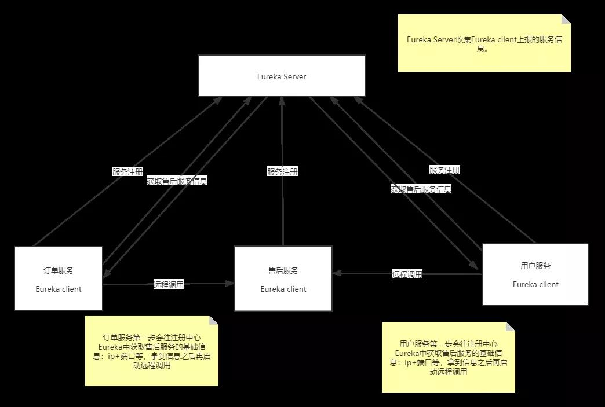
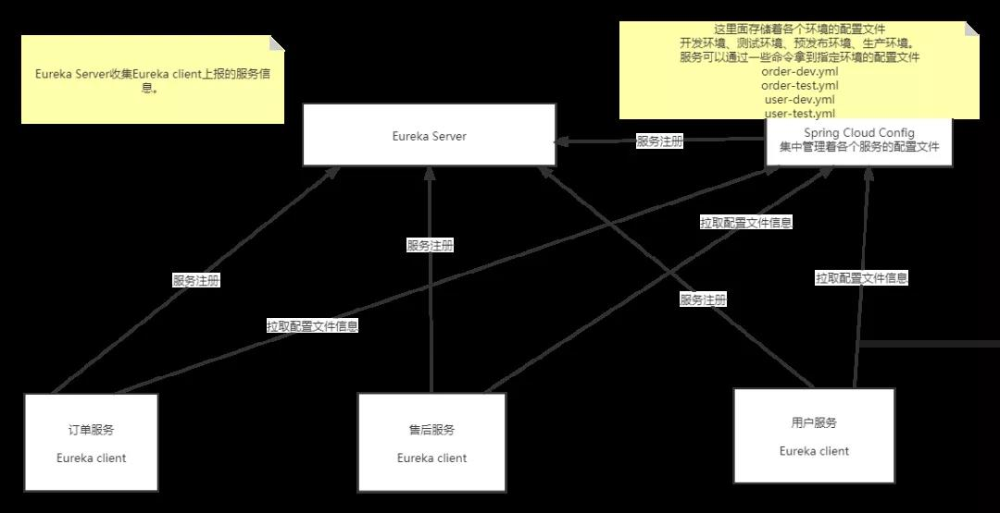
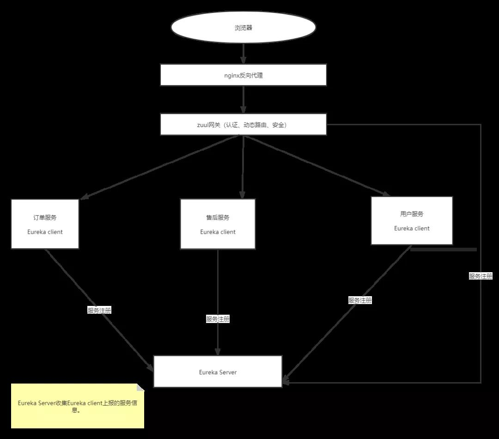
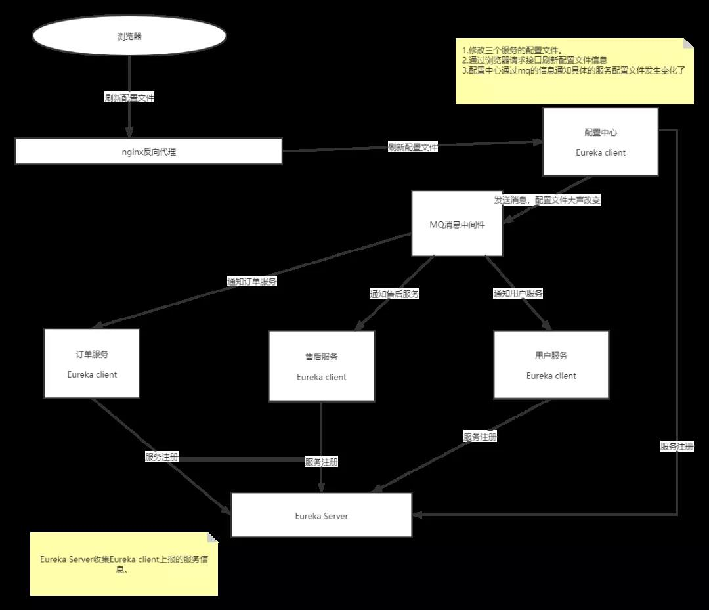
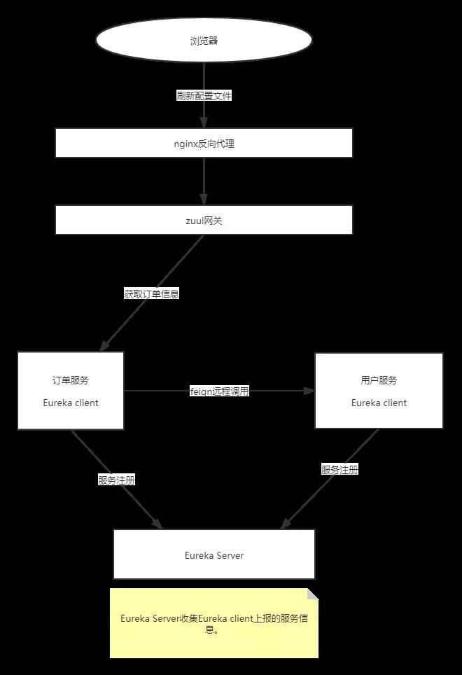
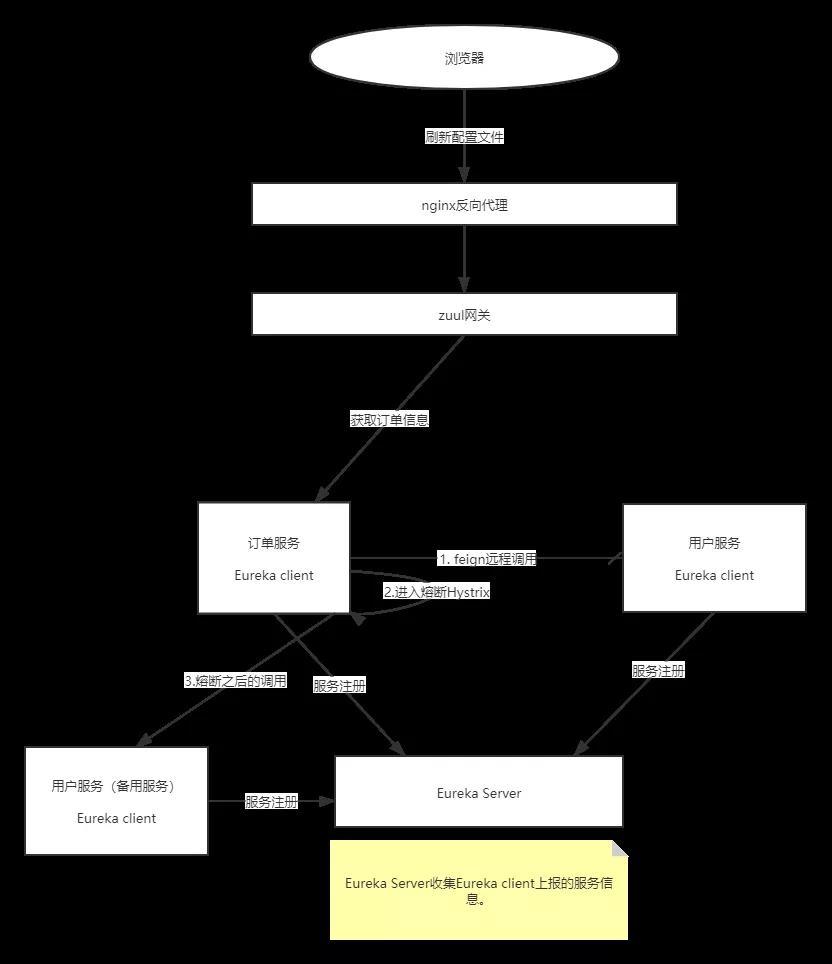
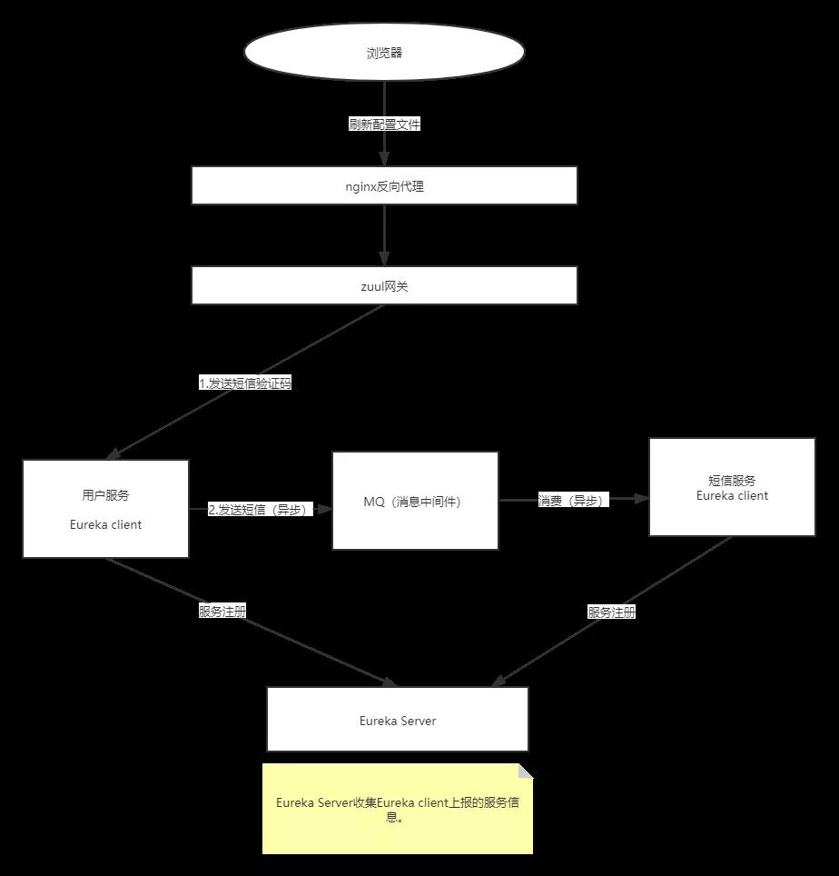
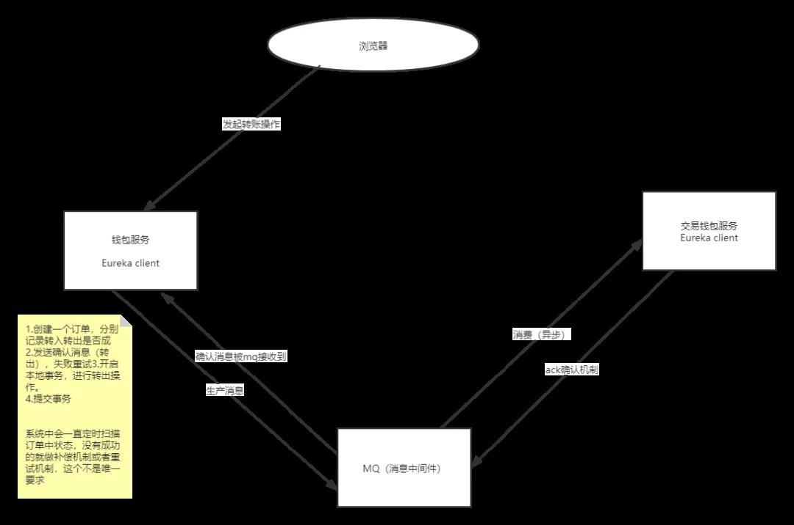
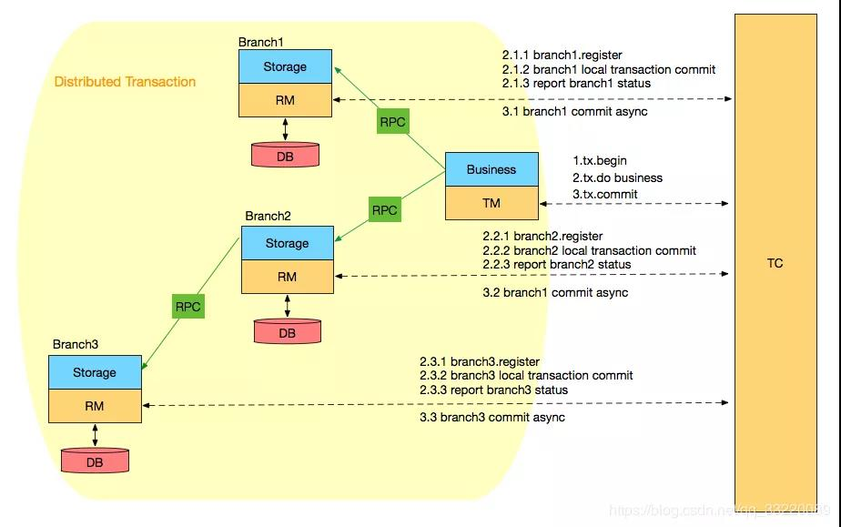
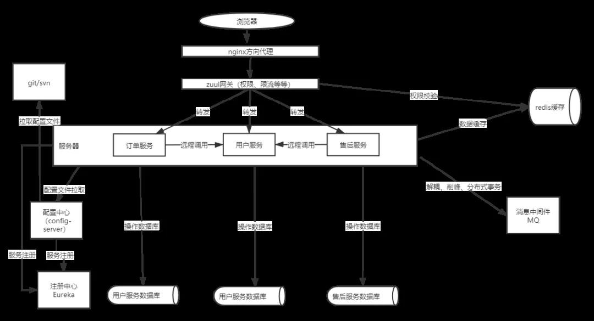

# 基于SpringCloud分布式架构

## 为什么要使用分布式架构

* Spring Cloud 专注于提供良好的开箱即用经验的典型用例和可扩展性机制覆盖
* 分布式/版本化配置
* 服务注册和发现
* 路由
* Service-to-Service 调用
* 负载均衡
* 断路器
* 分布式消息传递

这是分布式的优点，这样看起来可能比较抽象，举个例子来说，对于单体服务来说，如果我想更新订单中的某个功能，我是不是需要重启整个服务。

这个时候就会导致整个项目都处于不可用状态，或者在处理订单的时候由于程序代码写的有问题，导致死锁了，这个时候也会导致整个服务处于宕机专改，容错率很差。

但是分布式不同，如上图所示，订单服务、售后服务、用户服务都是独立的服务，如果需要更新订单服务或者订单服务发生死锁，受影响的只会是订单服务，售后服务与用户服务还是可以正常工作的，这就是分布式相对单体来说最大的优势之一。

## 分布式基础组件

**Spring Cloud Config**：配置管理工具包，让你可以把配置放到远程服务器，集中化管理集群配置，目前支持本地存储、Git 以及 Subversion。

**Spring Cloud Bus**：事件、消息总线，用于在集群（例如，配置变化事件）中传播状态变化，可与 Spring Cloud Config 联合实现热部署。

**Eureka**：云端服务发现，一个基于 REST 的服务，用于定位服务，以实现云端中间层服务发现和故障转移。

**Hystrix**：熔断器，容错管理工具，旨在通过熔断机制控制服务和第三方库的节点,从而对延迟和故障提供更强大的容错能力。

**Zuul**：Zuul 是在云平台上提供动态路由,监控,弹性,安全等边缘服务的框架。Zuul 相当于是设备和 Netflix 流应用的 Web 网站后端所有请求的前门。

**Archaius**：配置管理 API，包含一系列配置管理 API，提供动态类型化属性、线程安全配置操作、轮询框架、回调机制等功能。

**Consul**：封装了 Consul 操作，Consul 是一个服务发现与配置工具，与 Docker 容器可以无缝集成。

**Spring Cloud for Cloud Foundry**：通过 Oauth2 协议绑定服务到 CloudFoundry，CloudFoundry 是 VMware 推出的开源 PaaS 云平台。

**Spring Cloud Sleuth**：日志收集工具包，封装了 Dapper 和 log-based 追踪以及 Zipkin 和 HTrace 操作，为 Spring Cloud 应用实现了一种分布式追踪解决方案。

**Spring Cloud Data Flow**：大数据操作工具，作为 Spring XD 的替代产品，它是一个混合计算模型，结合了流数据与批量数据的处理方式。

**Spring Cloud Security**：基于 Spring Security 的安全工具包，为你的应用程序添加安全控制。

**Spring Cloud Zookeeper**：操作 Zookeeper 的工具包，用于使用 Zookeeper 方式的服务发现和配置管理。

**Spring Cloud Stream**：数据流操作开发包，封装了与 Redis、Rabbit、Kafka 等发送接收消息。

**Spring Cloud CLI**：基于 Spring Boot CLI，可以让你以命令行方式快速建立云组件。

**Ribbon**：提供云端负载均衡，有多种负载均衡策略可供选择，可配合服务发现和断路器使用。

**Turbine**：Turbine 是聚合服务器发送事件流数据的一个工具，用来监控集群下 Hystrix 的 Metrics 情况。

**Feign**：Feign 是一种声明式、模板化的 HTTP 客户端。

**Spring Cloud Task**：提供云端计划任务管理、任务调度。

**Spring Cloud Connectors**：便于云端应用程序在各种 PaaS 平台连接到后端，如：数据库和消息代理服务。

**Spring Cloud Cluster**：提供 Leadership 选举，如：Zookeeper，Redis，Hazelcast，Consul 等常见状态模式的抽象和实现。

**Spring Cloud Starters**：Spring Boot 式的启动项目，为 Spring Cloud 提供开箱即用的依赖管理。

>我们常用的组件：

* Spring Cloud Config
* Spring Cloud Bus
* Hystrix
* Eureka
* Zuul
* Ribbon
* Feign

### Eureka

Eureka 属于 Spring Cloud Netflix 下的组件之一，主要负责服务的注册与发现，何为注册与发现？

在刚刚我们分析的分布式中存在这一个问题，那就是订单服务与用户服务被独立了，那么他们怎么进行通信呢？比如在订单服务中获取用户的基础信息，这个时候我们需要怎么办？

如果按照上面的架构图，直接去数据库获取就可以了，因为服务虽然独立了，但是数据库还是共享的，所以直接查询数据库就能得到结果，如果我们将数据库也拆分了呢？这个时候我们该怎么办呢？

有人想到了，服务调用，服务调用是不是需要 IP 和端口才可以，那问题来了，对于订单服务来说，我怎么知道用户服务的 IP 和端口呢？在订单服务中写死吗？如果用户服务的端口发生改变了呢？

这个时候 Eureka 就出来了，他就是为了解决服务的通信问题，每个服务都可以将自己的信息注册到 Eureka 中，比如 IP、端口、服务名等信息，这个时候如果订单服务想要获取用户服务的信息，只需要去 Eureka 中获取即可。

请看下图：



这就是 Eureka 的主要功能，也是我们使用中的最值得注意的，他让服务之间的通信变得更加的简单灵活。

### Spring Cloud Config

Spring Cloud Config 为分布式系统中的外部配置提供服务器和客户端支持。使用 Config Server，您可以在所有环境中管理应用程序的外部属性。

客户端和服务器上的概念映射与 Spring Environment 和 PropertySource 抽象相同，因此它们与 Spring 应用程序非常契合，但可以与任何以任何语言运行的应用程序一起使用。

随着应用程序通过从开发人员到测试和生产的部署流程，您可以管理这些环境之间的配置，并确定应用程序具有迁移时需要运行的一切。

服务器存储后端的默认实现使用 Git，因此它轻松支持标签版本的配置环境，以及可以访问用于管理内容的各种工具。可以轻松添加替代实现，并使用 Spring 配置将其插入。

简单点来说集中来管理每个服务的配置文件，将配置文件与服务分离，这么多的目的是什么？

举个简单的栗子，我们配置文件中肯定会存在数据库的连接信息，Redis 的连接信息，我们的环境是多样的，有开发环境、测试环境、预发布环境、生产环境。

每个环境对应的连接信息肯定是不相同的，难道每次发布的时候都要去修改一下服务中的配置文件？

我能不能将这些变动较大的配置集中管理，不同环境的管理者分别对他们进行修改，就不需要再服务中做改动了，Config 就做到了。



这就是 Config 的大致架构，所有的配置文件都集中交给 Config 管理，拿 Config 怎么管理这些配置文件呢？

你可以将每个环境的配置文件存放再一个位置，比如 Lgitlab、SVN、本地等等，Config 会根据根据你设置的位置读取配置文件进行管理，然后其他服务启动的时候直接到 Config 配置中心获取对应的配置文件即可。

这样开发人员只需要关注 -dev 的配置文件，测试人员只需要关注 -test 的配置文件，完全和服务解耦，你值得拥有。

### Netflix Zuul（网关）

路由在微服务体系结构的一个组成部分。例如，/可以映射到您的 Web 应用程序，/api/users 映射到用户服务，并将 /api/shop 映射到商店服务。Zuul 是 Netflix 的基于 JVM 的路由器和服务器端负载均衡器。

>Netflix 使用 Zuul 进行以下操作：

* 认证 -洞察
* 压力测试
* 金丝雀测试
* 动态路由
* 服务迁移
* 负载脱落
* 安全
* 静态响应处理
* 主动/主动流量管理

我们在日常开发过程中并不会使用那么多，基本上就是认证、动态路由、安全等等，我画了一张关于网关的架构图，请看：



注意：Nginx 只能为我们做反向代理，不能做到权限认证，网关不但可以做到代理，也能做到权限认证、甚至还能做限流，所以我们要做分布式项目，少了他可不行。

### Spring Cloud Bus

``` yml
application.yml
spring:
  datasource:
    username: root
    password: 123456
    url: jdbc:mysql://localhost:3306/test
    driver-class-name: com.mysql.cj.jdbc.Driver
```

比如上面这行配置大家都应该很熟悉，这是数据库的连接信息，如果它发生改变了怎么办呢？

我们都知道，服务启动的时候会去 Config 配置中心拉取配置信息，但是启动完成之后修改了配置文件我们应该怎么办呢，重启服务器吗？

我们可以通过 Spring Cloud Bus 来解决这个问题，Spring Cloud Bus 将轻量级消息代理链接到分布式系统的节点。然后可以将其用于广播状态更改（例如，配置更改）或其他管理指令。

我们可以通过 Spring Cloud Bus 来解决这个问题，Spring Cloud Bus 将轻量级消息代理链接到分布式系统的节点。然后可以将其用于广播状态更改（例如，配置更改）或其他管理指令。

这个需要我们有一点的 MQ 基础，不管是 RabbitMQ 还是 Kafka，都可以。

Bus 的基本原理就是：配置文件发生改变时，Config 会发出一个 MQ，告诉服务，配置文件发生改变了，并且还发出了改变的哪些信息，这个时候服务只需要根据 MQ 的信息做实时修改即可。

这是一个很简单的原理，理解起来可能也不会怎么难，画个图来理解一下：



大致流程就是这样，核心就是通过 MQ 机制实现不重启服务也能做到配置文件的改动，这方便了运维工程师，不用每次修改配置文件的时候都要去重启一遍服务的烦恼。

### Feign
>Feign 是一个声明式的 Web 服务客户端。这使得 Web 服务客户端的写入更加方便 要使用 Feign 创建一个界面并对其进行注释。

它具有可插入注释支持，包括 Feign 注释和 JAX-RS 注释。Feign 还支持可插拔编码器和解码器。

Spring Cloud 增加了对 Spring MVC 注释的支持，并使用 Spring Web 中默认使用的 HttpMessageConverters。

Spring Cloud 集成 Ribbon 和 Eureka 以在使用 Feign 时提供负载均衡的 HTTP 客户端。



Feign 基于 Rest 风格，简单易懂，他的底层是对 HttpClient 进行了一层封装，使用十分方便。

### Netflix Hystrix（熔断）
>Hystrix 支持回退的概念：当电路断开或出现错误时执行的默认代码路径。要为给定的 @FeignClient 启用回退，请将 Fallback 属性设置为实现回退的类名。

我们可以改造一下刚刚的调用架构：



在这里我部署了一台备用服务器，当用户服务宕机了之后，订单服务进行远程调用的时候可以进入备用服务，这样就不会导致系统崩溃。


### MQ（消息中间件）

我现在这里有一个需求，修改密码，修改密码需要发送短信验证码，发送短信在短信服务中，修改密码在用户服务中，这个时候就会出现服务调用。

而且我们知道，发送短信一般都是调用第三方的接口，那比如阿里的，既然牵扯到调用，那么就会存在很多不确定因素，比如网络问题。

假如，用户再点击发送短信验证码到时候用户服务调用短信服务，但是在短信服务中执行调用阿里的接口花费了很长的时间。

这个时候就会导致用户服务调短信服务超时，会返回给用户失败，但是，短信最后又发出去了，这种问题怎么解决呢？

我们可以通过消息中间件来实现，使用异步讲给用户的反馈和发送短信分离，只要用户点了发送短信，直接返回成功，然后再启动发送验证码，60 秒重发一下，就算发送失败，用户还可以选择重新发送。

MQ 不但可以解耦服务，它还可以用来削峰，提高系统的性能，是一个不错的选择。



### 分布式事务

既然我们使用了分布式架构，那么有一点是我们必须要注意的，那就是事务问题。

如果一个服务的修改依赖另外一个服务的操作，这个时候如果操作不慎，就会导致可怕的后果。

举个例子，两个服务：钱包服务（用于充值提现）、交易钱包服务（用于交易），我现在想从钱包服务中转 1000 元到交易钱包服务中，我们应该如何保证他们数据的一致性呢？

我这里有两种方案，第一种是通过 MQ 来保证一致性，另外一种就是通过分布式事务来确保一致性。

#### MQ 确保一致性

* 生成一个订单表，记录着转入转出的状态。
* 向 MQ 发送一条确认消息。
* 开启本地事务，执行转出操操作，并且提交事务。

交易钱包服务：接收 MQ 的消息，进行转入操作（此操作需要 Ack 确认机制的支持）。

系统中会一直定时扫描订单中状态，没有成功的就做补偿机制或者重试机制，这个不是唯一要求。



以上就是 MQ 确保分布式事务的大致思路，不是唯一，仅供参考。

#### Seata（分布式事务）

Seata 有三个基本组成部分：

* **事务协调器（TC）**：维护全局事务和分支事务的状态，驱动全局提交或回滚。
* **事务管理器 TM**：定义全局事务的范围：开始全局事务，提交或回滚全局事务。
* **资源管理器（RM）**：管理分支事务正在处理的资源，与 TC 进行对话以注册分支事务并报告分支事务的状态，并驱动分支事务的提交或回滚。



Seata 管理的分布式事务的典型生命周期：

* TM 要求 TC 开始一项新的全球交易。TC 生成代表全局事务的 XID。
* XID 通过微服务的调用链传播。
* RM 将本地事务注册为 XID 到 TC 的相应全局事务的分支。
* TM 要求 TC 提交或回滚 XID 的相应全局事务。
* TC 驱动 XID 对应的全局事务下的所有分支事务以完成分支提交或回滚。

## 完整的分布式架构

完整的分布式架构如下图：



这就是一套分布式基本的架构，请求从浏览器发出，经过 Nginx 反向代理到 Zuul 网关。

网关经过权限校验、然后分别转发到对应的服务中，每个服务都有自己独立的数据库，如果需要跨库查询的时候就需要用到分布式的远程调用（Feign）。

虽然这里我将服务拆分了，但是有一点需要注意的是网关，网关承载着所有的请求，如果请求过大会发生什么呢？

服务宕机，所以一般情况下，网关都是集群部署，不止网关可以集群，其他的服务都可以做集群配置，比如：注册中心、Redis、MQ 等等都可以。

那我们将这个流程图再改良一下：


现在这套架构就是比较程数的一套了，不管是性能还是稳定能，都是杠杠的，技术选择性的会也开得差不多了，最后技术总监做了一个总结。

## 总结

### 单体服务与分布式服务区别

  |传统单体架构|分布式服务架构|
--|--|--
新功能开发|需要时间|容易开发和实现
部署|不经常且容易部署|经常发布，部署复杂
隔离性|故障影响范围大|故障影响范围小
架构设计|难度小|难度级数增大
系统性能|响应时间快，吞吐量小|响应时间慢，吞吐量大
系统运维|运维简单|运维复杂
新手上手|学习曲线大(业务逻辑)|学习曲线大(构架逻辑)
技术|技术单一且封闭|技术多样且开放
测试和查错|简单|复杂
系统扩展性|扩展性差|扩展性很好
系统管理|重点在于开放成本|重点在于服务治理和调度

### 什么时候使用分布式/集群？

总结如下几点：

* 单机无法支持的时候。
* 想要更好的隔离性（功能与功能）。
* 想要更好用户体验的时候。
* 想要更好的扩展性。
* 想要更快的响应，更搞得吞吐量。

### 使用分布式注意事项

虽然现在分布式技术已经十分成熟，但是里面的坑不是一点两点，比如：==如何保证分布式事务的一致性、如何保证服务调用的幂等性、如何保证消息的幂等性、如何设置熔断（服务的降级），如何保证服务的健壮性等等，==这些都是一直需要关注的问题，只有解决了这些问题，你的分布式架构才能真正的立于不败之地。

### 关于组件停更消息


目前注册中心 Eureka、网关 Zuul，Feign 都相继停更了，停更不代表不能使用，只是除了 Bug 可能不会主动修复，所以这个时候我们可能就需要选择另外的组件了。

注册中心可以使用 Consul、Nacos，Zookeeper，网关则可以通过 Gateway 替换，OpenFeign 替换 Fiegn。

所以也没必要听到组件停更的消息就担心 Cloud 会不会凉，放心，它至少最近几年是不会凉的。


