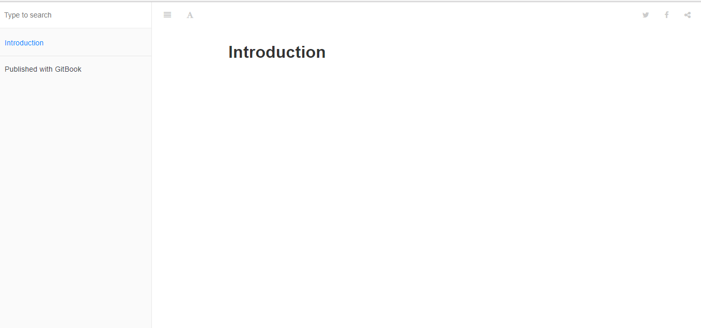
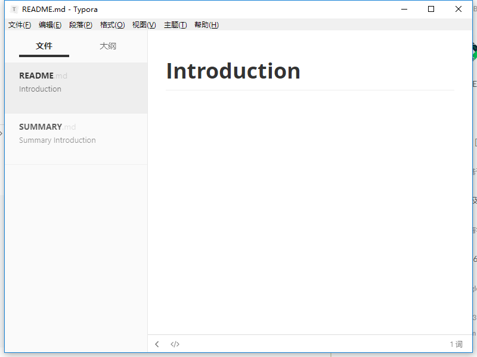
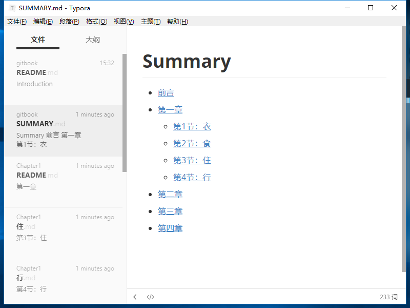
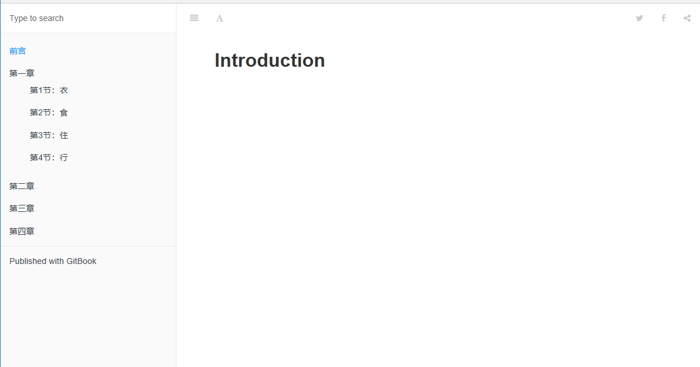
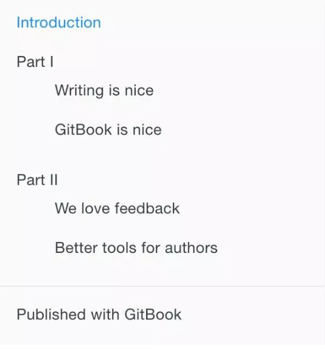
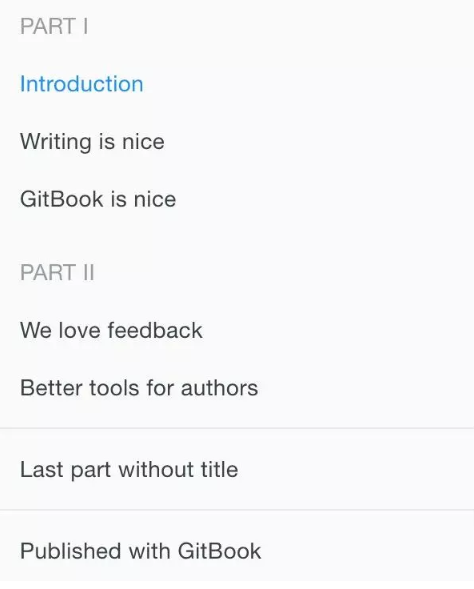

# GitBook 使用教程
首先先献上 我的 [blog](https://burningmyself.github.io/blog/ "blog") 地址，可以在我的博客导航栏处找到，下面进行相关的介绍。
## 背景
由于之前都把零散的知识都写在博客园上，要查找的时候不是很系统化，所以打算挪到[GitBook](https://www.gitbook.com/?t=2 "GitBook") 上来统一管理，而且[GitBook](https://www.gitbook.com/?t=2 "GitBook") 写完编译后可以生成静态页面发布到博客上，逼格满满的样子。
## GitBook 简介
* [GitBook 官网](https://docs.gitbook.com/ "官网")
* [GitBook 文档](https://docs.gitbook.com/ "文档")
* [GitBook GitHub](https://github.com/GitbookIO/gitbook "GitHub")
## GitBook 准备工作
上面我推荐的是 Node.js + GitBook + Typora + Git，所以你还需要安装 Typora（一个很棒的支持 macOS、Windows、Linux 的 Markdown 编辑工具）和 Git 版本管理工具。戳下面：
* [Node.js](https://nodejs.org/en/)
* [Typora](https://typora.io/)
* [Git](https://git-scm.com/)
### 安装 Node.js
GitBook 是一个基于[Node.js](https://nodejs.org/en/ "Node.js") 的命令行工具，下载安装 Node.js，安装完成之后，你可以使用下面的命令来检验是否安装成功。
```node
$ node -v
v10.5.0
```
### 安装 GitBook
输入下面的命令来安装 GitBook。
```node
$ npm install gitbook-cli -g
```
安装完成之后，你可以使用下面的命令来检验是否安装成功
```node
$ gitbook -V
CLI version: 2.3.2
Installing GitBook 3.2.3
```
更多详情请参照[GitBook 安装文档](https://docs.gitbook.com/ "文档") 来安装 GitBook。
### 安装 Typora
Typora 的安装很简单，难点在于需要翻墙才能下载（当然你也可以找我要）。Git 的安装也很简单，但要用好它需要不少时间，这里就不展开了（再讲下去你就要跑啦）。
### 安装 GitBook 编辑器
去[GitBook 官网](http://downloads.editor.gitbook.com/download/ "官网") 下载 GitBook 编辑器；如果是 Mac 用户且安装过 brew cask 的话可以使用 brew cask install gitbook-editor 命令行来安装 GitBook 编辑器。
## 先睹为快
GitBook 准备工作做好之后，我们进入一个你要写书的目录，输入如下命令。
```node
$ gitbook init
warn: no summary file in this book
info: create README.md
info: create SUMMARY.md
info: initialization is finished
```
可以看到他会创建 README.md 和 SUMMARY.md 这两个文件，README.md 应该不陌生，就是说明文档，而 SUMMARY.md 其实就是书的章节目录，其默认内容如下所示：
```
# Summary

* [Introduction](README.md)
```
接下来，我们输入 $ gitbook serve 命令，然后在浏览器地址栏中输入 http://localhost:4000 便可预览书籍。
效果如下所示：


运行该命令后会在书籍的文件夹中生成一个 _book 文件夹, 里面的内容即为生成的 html 文件，我们可以使用下面命令来生成网页而不开启服务器。
```
gitbook build
```
下面我们来详细介绍下 GitBook 目录结构及相关文件。
### Typora 来编辑这两个文件

编辑 SUMMARY.md 文件，内容修改为：
```
# 目录

* [前言](README.md)
* [第一章](Chapter1/README.md)
  * [第1节：衣](Chapter1/衣.md)
  * [第2节：食](Chapter1/食.md)
  * [第3节：住](Chapter1/住.md)
  * [第4节：行](Chapter1/行.md)
* [第二章](Chapter2/README.md)
* [第三章](Chapter3/README.md)
* [第四章](Chapter4/README.md)

```
然后我们回到命令行，在 mybook 文件夹中再次执行 gitbook init 命令。GitBook 会查找 SUMMARY.md 文件中描述的目录和文件，如果没有则会将其创建。

Typora 是所见即所得（实时渲染）的 Markdown 编辑器，这时候它是这样的：



接着我们执行 gitbook serve 来预览这本书籍，执行命令后会对 Markdown 格式的文档进行转换，默认转换为 html 格式，最后提示 “Serving book on http://localhost:4000”。嗯，打开浏览器看一下吧：


### gitbook 常用命令

当你写得差不多，你可以执行 gitbook build 命令构建书籍，默认将生成的静态网站输出到 _book 目录。实际上，这一步也包含在 gitbook serve 里面，因为它们是 HTML，所以 GitBook 通过 Node.js 给你提供服务了。 
1. 当然，build 命令可以指定路径：
```
gitbook build [书籍路径] [输出路径]
```
2. serve 命令也可以指定端口：
```
gitbook serve --port 2333
```
3. 你还可以生成 PDF 格式的电子书：
```
gitbook pdf ./ ./mybook.pdf
```
4. 生成 epub 格式的电子书：
```
gitbook epub ./ ./mybook.epub
```
5. 生成 mobi 格式的电子书：
```
gitbook mobi ./ ./mybook.mobi
```

基本命令
```
gitbook init //初始化目录文件
gitbook help //列出gitbook所有的命令
gitbook --help //输出gitbook-cli的帮助信息
gitbook build //生成静态网页
gitbook serve //生成静态网页并运行服务器
gitbook build --gitbook=2.0.1 //生成时指定gitbook的版本, 本地没有会先下载
gitbook ls //列出本地所有的gitbook版本
gitbook ls-remote //列出远程可用的gitbook版本
gitbook fetch 标签/版本号 //安装对应的gitbook版本
gitbook update //更新到gitbook的最新版本
gitbook uninstall 2.0.1 //卸载对应的gitbook版本
gitbook build --log=debug //指定log的级别
gitbook builid --debug //输出错误信息
```
如果生成不了，你可能还需要安装一些工具，比如 ebook-convert。或者在 Typora 中安装 Pandoc 进行导出。

除此之外，别忘了还可以用 Git 做版本管理呀！在 mybook 目录下执行 git init 初始化仓库，执行 git remote add 添加远程仓库（你得先在远端建好）。接着就可以愉快地 commit，push，pull … 啦！


下面我们主要来讲讲 book.json 和 SUMMARY.md 文件。
### book.json
该文件主要用来存放配置信息，我先放出我的配置文件。
```conf
{
    "title": "Blankj's Glory",
    "author": "Blankj",
    "description": "select * from learn",
    "language": "zh-hans",
    "gitbook": "3.2.3",
    "styles": {
        "website": "./styles/website.css"
    },
    "structure": {
        "readme": "README.md"
    },
    "links": {
        "sidebar": {
            "我的狗窝": "https://blankj.com"
        }
    },
    "plugins": [
        "-sharing",
        "splitter",
        "expandable-chapters-small",
        "anchors",

        "github",
        "github-buttons",
        "donate",
        "sharing-plus",
        "anchor-navigation-ex",
        "favicon"
    ],
    "pluginsConfig": {
        "github": {
            "url": "https://github.com/Blankj"
        },
        "github-buttons": {
            "buttons": [{
                "user": "Blankj",
                "repo": "glory",
                "type": "star",
                "size": "small",
                "count": true
                }
            ]
        },
        "donate": {
            "alipay": "./source/images/donate.png",
            "title": "",
            "button": "赞赏",
            "alipayText": " "
        },
        "sharing": {
            "douban": false,
            "facebook": false,
            "google": false,
            "hatenaBookmark": false,
            "instapaper": false,
            "line": false,
            "linkedin": false,
            "messenger": false,
            "pocket": false,
            "qq": false,
            "qzone": false,
            "stumbleupon": false,
            "twitter": false,
            "viber": false,
            "vk": false,
            "weibo": false,
            "whatsapp": false,
            "all": [
                "google", "facebook", "weibo", "twitter",
                "qq", "qzone", "linkedin", "pocket"
            ]
        },
        "anchor-navigation-ex": {
            "showLevel": false
        },
        "favicon":{
            "shortcut": "./source/images/favicon.jpg",
            "bookmark": "./source/images/favicon.jpg",
            "appleTouch": "./source/images/apple-touch-icon.jpg",
            "appleTouchMore": {
                "120x120": "./source/images/apple-touch-icon.jpg",
                "180x180": "./source/images/apple-touch-icon.jpg"
            }
        }
    }
}
```
相信很多节点自己也能猜到是什么意思，我还是简单介绍下吧。
* title:本书标题
* author:本书作者
* description:本书描述
* language:本书语言，中文设置 "zh-hans" 即可
* gitbook:指定使用的 GitBook 版本
* styles:自定义页面样式
* structure:指定 Readme、Summary、Glossary 和 Languages 对应的文件名
* links:在左侧导航栏添加链接信息
* plugins:配置使用的插件
* pluginsConfig:配置插件的属性
* SUMMARY.md:这个文件主要决定 GitBook 的章节目录，它通过 Markdown 中的列表语法来表示文件的父子关系，下面是一个简单的示例：
```
# Summary

* [Introduction](README.md)
* [Part I](part1/README.md)
    * [Writing is nice](part1/writing.md)
    * [GitBook is nice](part1/gitbook.md)
* [Part II](part2/README.md)
    * [We love feedback](part2/feedback_please.md)
    * [Better tools for authors](part2/better_tools.md)
```
这个配置对应的目录结构如下所示:

我们通过使用 标题 或者 水平分割线 将 GitBook 分为几个不同的部分，如下所示
```
# Summary

### Part I

* [Introduction](README.md)
* [Writing is nice](part1/writing.md)
* [GitBook is nice](part1/gitbook.md)

### Part II

* [We love feedback](part2/feedback_please.md)
* [Better tools for authors](part2/better_tools.md)

---

* [Last part without title](part3/title.md)
```
这个配置对应的目录结构如下所示:


### 插件

GitBook 有 [插件官网](https://plugins.gitbook.com/ "插件官网")，默认带有 5 个插件，highlight、search、sharing、font-settings、livereload，如果要去除自带的插件， 可以在插件名称前面加 -，比如：
```
"plugins": [
    "-search"
]
```
如果要配置使用的插件可以在 book.json 文件中加入即可，比如我们添加 [plugin-github](https://plugins.gitbook.com/plugin/github )，我们在 book.json 中加入配置如下即可：
```
{
    "plugins": [ "github" ],
    "pluginsConfig": {
        "github": {
            "url": "https://github.com/your/repo"
        }
    }
}
```
然后在终端输入 gitbook install ./ 即可。

如果要指定插件的版本可以使用 plugin@0.3.1，因为一些插件可能不会随着 GitBook 版本的升级而升级。
##结语
这是我对 GitBook 使用的总结，希望能帮到今后需要的小伙伴

[相关资料](https://blog.csdn.net/axi295309066/article/details/61420694/)