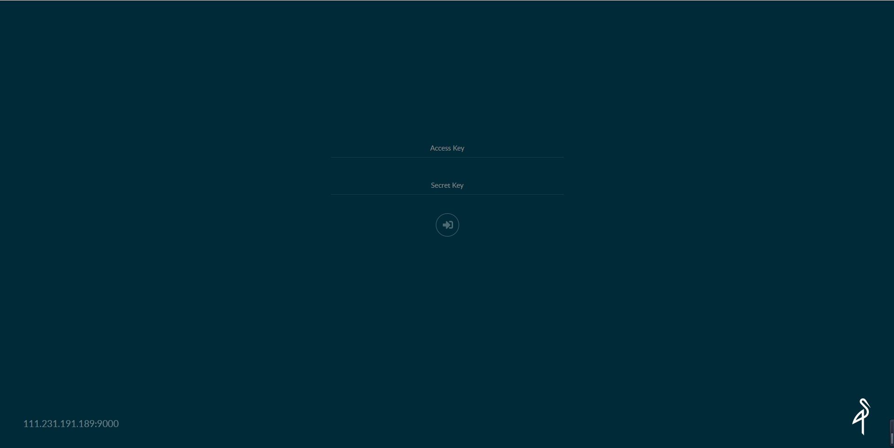
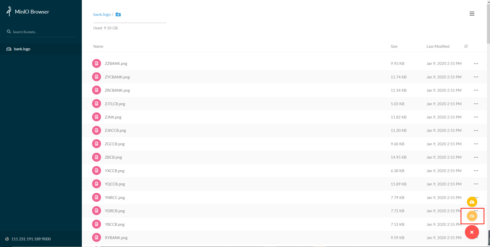
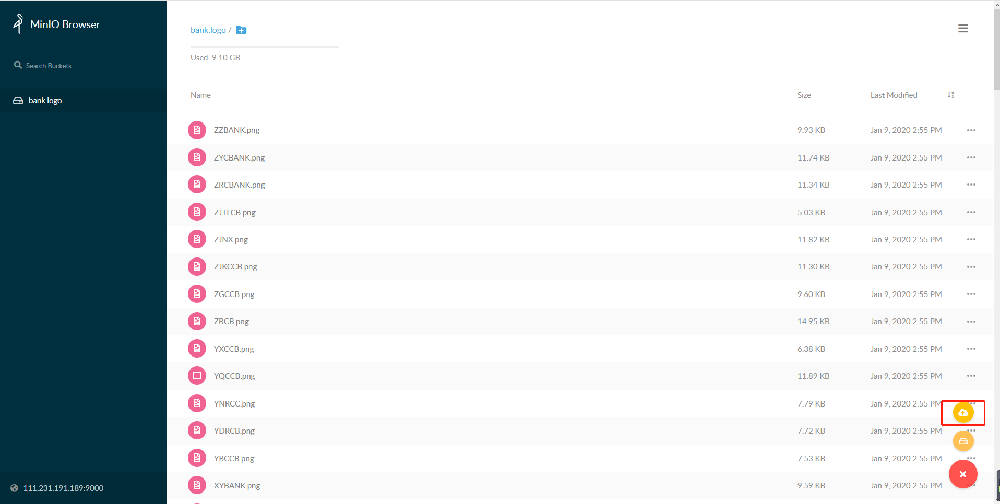
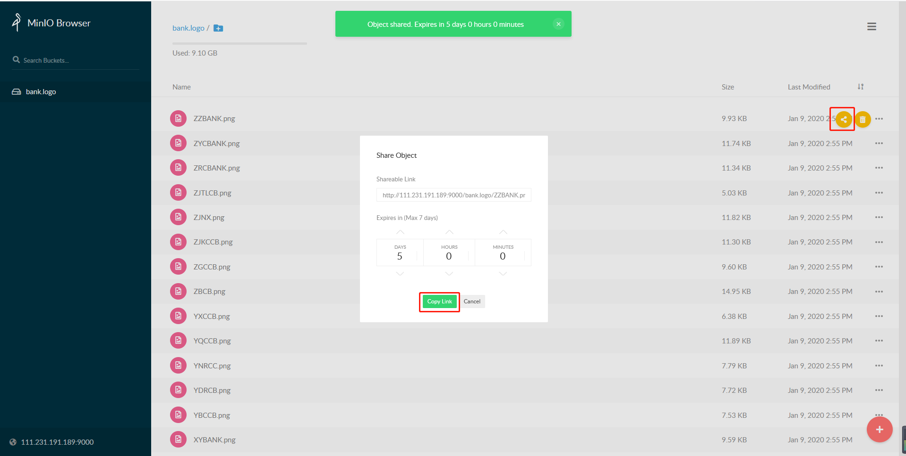
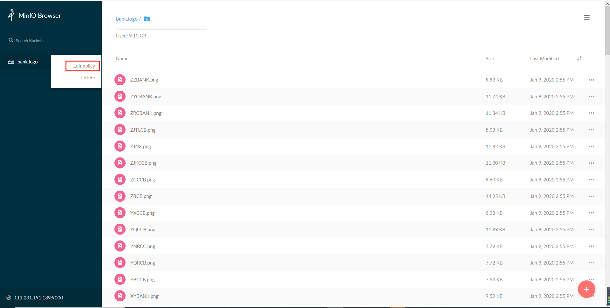
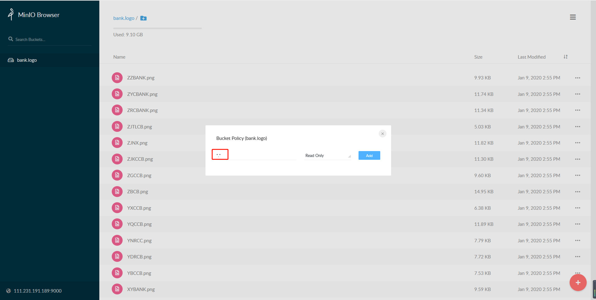

# MinIO 搭建使用

## MinIO简介

MinIO 是一款基于Go语言的高性能对象存储服务，在Github上已有19K+Star。它采用了Apache License v2.0开源协议，非常适合于存储大容量非结构化的数据，例如图片、视频、日志文件、备份数据和容器/虚拟机镜像等。 本文将使用 MinIO 来自建一个对象存储服务用于存储图片。

## 安装及部署

> MinIO的安装方式有很多，这里我们使用它在Docker环境下的安装方式。

* 下载MinIO的Docker镜像：

``` shell
docker pull minio/minio
```

* 在Docker容器中运行MinIO，这里我们将MiniIO的数据和配置文件夹挂在到宿主机上：

``` shell
docker run -p 9090:9000 --name minio \
  -v /etc/localtime:/etc/localtime \
  -v /mydata/minio/data:/data \
  -v /mydata/minio/config:/root/.minio \
  -d minio/minio server /data
```

* 运行成功后，访问该地址来登录并使用MinIO，默认Access Key和Secret都是minioadmin：http://localhost:9090



## 上传文件及使用

>通过使用MinIO的网页端即可完成文件的上传下载功能，下面我们以图片上传下载为例来演示下该功能。

* 在存储文件之前，我们需要新建一个存储桶：



* 存储桶创建完成后，通过上传按钮可以上传文件，这里我们上传一张图片：



* 图片上传完成后，我们可以通过拷贝链接按钮来获取图片访问路径，但是这只是个临时的访问路径：



* 要想获取一个永久的访问路径，需要修改存储桶的访问策略，我们可以点击存储桶右上角的编辑策略按钮来修改访问策略；



* 这里有三种访问策略可以选择，一种只读、一种只写、一种可读可写，这里我们选择只读即可，但是需要注意的是，访问前缀需要设置为*.*，否则会无法访问；



* 设置完成后，我们只需要通过拷贝链接中的前一串路径即可永久访问该文件；

## MinIO客户端的使用

>虽然MinIO的网页端管理已经很方便了，但是官网还是给我们提供了基于命令行的客户端MinIO Client(简称mc)，下面我们来讲讲它的使用方法。

### 常用命令

> 下面我们先来熟悉下mc的命令，这些命令和Linux中的命令有很多相似之处。

| 命令    | 作用                                          |
| ------- | --------------------------------------------- |
| ls      | 列出文件和文件夹                              |
| mb      | 创建一个存储桶或一个文件夹                    |
| cat     | 显示文件和对象内容                            |
| pipe    | 将一个STDIN重定向到一个对象或者文件或者STDOUT |
| share   | 生成用于共享的URL                             |
| cp      | 拷贝文件和对象                                |
| mirror  | 给存储桶和文件夹做镜像                        |
| find    | 基于参数查找文件                              |
| diff    | 对两个文件夹或者存储桶比较差异                |
| rm      | 删除文件和对象                                |
| events  | 管理对象通知                                  |
| watch   | 监听文件和对象的事件                          |
| policy  | 管理访问策略                                  |
| session | 为cp命令管理保存的会话                        |
| config  | 管理mc配置文件                                |
| update  | 检查软件更新                                  |
| version | 输出版本信息                                  |

### 安装及配置

> 由于MinIO服务端中并没有自带客户端，所以我们需要安装配置完客户端后才能使用，这里以Docker环境下的安装为例。

- 下载MinIO Client 的Docker镜像：

```bash
docker pull minio/mc
```

- 在Docker容器中运行mc：

```bash
docker run -it --entrypoint=/bin/sh minio/mc
```

- 运行完成后我们需要进行配置，将我们自己的MinIO服务配置到客户端上去，配置的格式如下：

```bash
mc config host add <ALIAS> <YOUR-S3-ENDPOINT> <YOUR-ACCESS-KEY> <YOUR-SECRET-KEY> <API-SIGNATURE>
```

- 对于我们的MinIO服务可以这样配置：

```bash
mc config host add minio http://localhost:9000 minioadmin minioadmin S3v4
```

### 常用操作

- 查看存储桶和查看存储桶中存在的文件：

```bash
# 查看存储桶
mc ls minio
# 查看存储桶中存在的文件
mc ls minio/blog
```


- 创建一个名为`test`的存储桶：

```bash
mc mb minio/test
```

- 共享`avatar.png`文件的下载路径：

```bash
mc share download minio/blog/avatar.png
```

- 查找`blog`存储桶中的png文件：

```bash
mc find minio/blog --name "*.png"
```

- 设置`test`存储桶的访问权限为`只读`：

```bash
# 目前可以设置这四种权限：none, download, upload, public
mc policy set download minio/test/
# 查看存储桶当前权限
mc policy list minio/test/
```

## 参考资料

详细了解MinIO可以参考官方文档：https://docs.min.io/cn/minio-quickstart-guide.html
