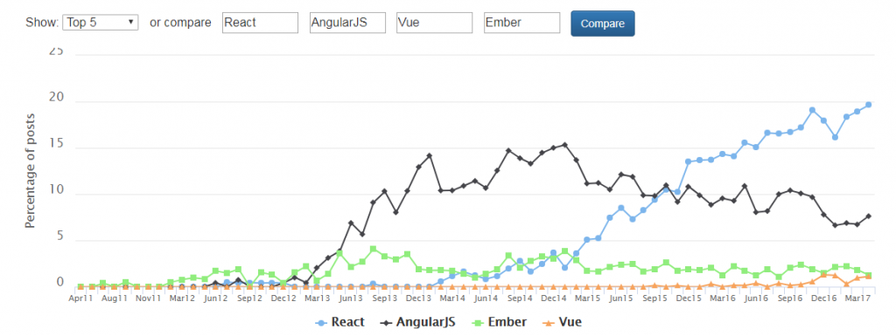
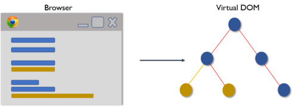
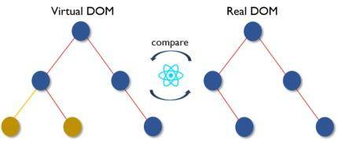
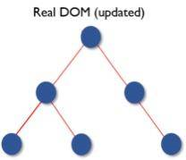
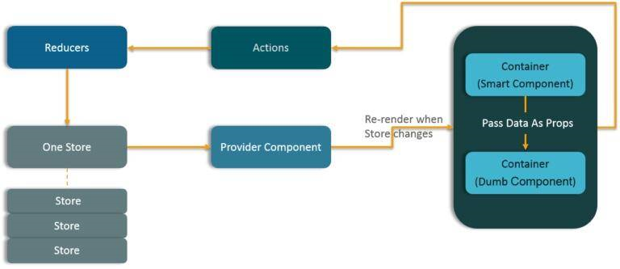

# React 面试问题
>如果你是一位有理想的前端开发人员，并且正在准备面试，那么这篇文章就是为你准备的。本文收集了 React 面试中最常见的 50 大问题，这是一份理想的指南，让你为 React 相关的面试做好充分的准备工作。首先我们快速了解一下 React 在市场上的需求和现状，然后再开始讨论 React 面试问题。

JavaScript 工具的市场地位正在缓慢而稳定地上升当中，而对 React 认证的需求正在飞速增长。选择正确的技术来开发应用程序或网站变得愈加艰难。React 被认为是 Javascript 语言中增长最快的框架。

虚拟 DOM 和可复用部件等独特特性吸引了前端开发人员的注意。尽管成熟的框架（如 Angular、Meteor 和 Vue 等）在 MVC（模型 - 视图 - 控制器）中只是一个“视图”库，但它们都有很强的竞争力。下图显示了常见 JS 框架的趋势：



以下是面试官最有可能提出的 50 个面试问题和答案。

## React 面试问题——常规知识

1. 真实 DOM 和虚拟 DOM 的区别

    真实 DOM|虚拟 DOM
    --|:--|
    1.更新较慢| 1.更新较快
    2.可以直接更新 HTML|2.不能直接更新 HTML
    3.元素更新时创建一个新 DOM|3.元素更新时更新 JSX
    4.DOM 操作开销较大|4.DOM 操作非常容易
    5.内存浪费严重|5.没有内存浪费

2. 什么是 React？

    * React 是 2011 年由 Facebook 开发的前端 JavaScript 库。
    * 它遵循基于组件的方法，这种方法可以用来构建可复用的 UI 组件。
    * 它用于复杂的交互式 Web 端和移动端用户界面开发。
    * 尽管它在 2015 年才开源，但得到了一家巨头的支持。

3. React 的特点是什么？

    * 轻量级 DOM，以获得更好的性能。
    * 在 React 中，一切都被视为组件。
    * React 使用 JSX（JavaScript eXtension），使我们可以编写类似于 HTML 的 JavaScript。
    * React 不是直接运行在浏览器的文档对象模型（DOM）上，而是运行在虚拟 DOM 上。
    * ReactJS 遵循单向数据流或单向数据绑定。

4. 列出 React 的一些主要优势。
  
    * 可以提高应用程序的性能。
    * 可以方便地用在客户端和服务端。
    * 由于有了 JSX，代码的可读性提高了。
    * 使用 React 后，编写 UI 测试用例变得非常容易。

5. React 有哪些局限？

    * React 只是一个库，而不是一个成熟的框架。
    * 它的库很大，需要花费一些时间来理解。
    * 新手程序员可能很难入门。
    * 由于它使用了内联模板和 JSX，编码也比较复杂。

6. 什么是 JSX？

JSX 是 JavaScript XML 的简写。这是 React 使用的一种文件类型，具备 JavaScript 的表现力，并使用 HTML 作为模板语法。这样一来 HTML 文件理解起来就非常简单。这种文件可以创造稳健的应用程序并提高其效率。下面是一个 JSX 实例：

``` jsx
render(){
    return(        
           <div>
                <h1> Hello World from Codersera!!</h1>
           </div>
          );
        }
```
7. 你对虚拟 DOM 有什么了解？解释其工作机制。

虚拟 DOM 是轻量级的 JavaScript 对象，一开始只是真实 DOM 的一个副本。它是一个节点树，将组件列为对象及其属性和内容的列表。React 的渲染功能从 React 的各个部分生成一个节点树。然后，它会根据由不同用户或系统行为引起的信息模型突变来更新此树。
虚拟 DOM 的工作机制只有简单的三步组成。

    1. 每当任何基础信息更改时，整个 UI 就会以虚拟 DOM 的表示形式重新渲染。
    
  

    2. 然后计算先前的 DOM 表示和新的 DOM 表示之间的区别。

    

    3. 计算完成后，只有实际更改的内容才会更新到真实 DOM。

    

8. 为什么浏览器无法读取 JSX？

React 使用 JSX（JavaScript eXtension），我们可以用它编写类似于 HTML 的 JavaScript。但由于 JSX 不是合法的 JavaScript，因此浏览器无法直接读取它。如果 JavaScript 文件包含 JSX，则必须将其转换。你需要一个转换器将 JSX 转换为浏览器可以理解的常规 Javascript。目前最常用的转换器是 Babel。

9. 与 ES5 相比，React 的 ES6 语法有何不同？

ES5 和 ES6 的语法区别如下：

```javascript
// ES5
var React = require('react');
// ES6
import React from 'react';
 
********  export vs exports *********
 
// ES5
module.exports = Component;
// ES6
export default Component;
 
****** function *****
// ES5
 
var MyComponent = React.createClass({
  render: function() {
    return <h3> Hello CoderSera! </h3>
  },
});
 
// ES6
class MyComponent extends React.Component {
  render() {
    return <h3> Hello CoderSera! </h3>
  }
}
 
 *******  props  ******
 
// ES5
var App = React.createClass({
  propTypes: { name: React.PropTypes.string },
  render: function() {
    return <h3> Hello, { this.props.name }! < /h3>
  },
});
 
// ES6
class App extends React.Component {
  render() {
    return <h3> Hello, { this.props.name }! </h3>
  }
}
 
 ****** state *****
 
// ES5
var App = React.createClass({
  getInitialState: function() {
    return { name: 'world' };
  } 
  
  render: function() {
    return <h3> Hello, { this.state.name }! < /h3>;
  },
});
 
// ES6
class App extends React.Component {
  constructor() {
    super();
    this.state = { name: 'world' };
  }
 
  render() {
    return <h3> Hello, { this.state.name }! < /h3>
  }
  render() {
    return;
    <h3> Hello, { this.state.name }! < /h3>
  }

```

10. React 和 Angular 有何不同？

React 对比 Angular|React|Angular
--|:--|:--|
架构|使用虚拟 DOM|使用真实 DOM
渲染|服务端渲染|客户端渲染
DOM|使用虚拟 DOM|使用真实 DOM
数据绑定|单向数据绑定|双向数据绑定
调试|编译时调试|运行时调试
开发者|Facebook|谷歌

11. 如何理解“在 React 中，一切都是组件”。

React 应用程序的 UI 构建块都是组件。这些部分将整个 UI 划分为许多可自治和可复用的微小部分。然后独立的某个部分发生变化就不会影响 UI 的其余部分。

12. 解释 React 中 render() 的目的。

它被视为普通函数，但 render() 函数必须返回某些值，无论值是否为空。调用组件文件时默认会调用 render() 方法，因为组件需要显示 HTML 标记，或者我们可以说 JSX 语法。每个 React 组件必须有一个 render() 函数，它返回单个 React 元素，该元素代表原生 DOM 组件。如果需要渲染多个 HTML 元素，则必须将它们分组在一个封闭的标签内，如form、group和div等。此函数必须保持纯净，就是说它在每次调用时必须返回相同的结果。

``` jsx
import React, { Component } from 'react';
 
class App extends Component {
  render() {
    return (<div> <h1 className='App-title'> hello CoderSera </h1></div>)
  }
}
 
export default App;

```

13. 什么是 Hooks？

Hooks 是一项新功能，使你无需编写类即可使用状态等 React 功能。来看一个 useState hook 示例。

```jsx
<em>import </em>{useState} <em>from </em>'react';<br><br><em>function </em>Example() {<br>    <em>// Declare a new
```

14. 什么是 props？

* Props 用于将数据从父级传递到子级或由组件本身传递。它们是不可变的，因此不会更改。

* Props 是不可变的。因为它们是基于纯函数的概念开发的。在纯函数中，我们无法更改参数数据。因此在 ReactJS 中也无法更改 props 的数据。

15. React 中的状态是什么，如何使用？

组件可以通过状态来跟踪其执行的任何渲染之间的信息。

状态用于可变数据或将要更改的数据。这对于用户输入尤其方便。以搜索栏为例，用户输入数据时他们看到的内容也会更新。

16. 状态和 props 的区别。

条件|状态|Props
--|:--|:--|
从父组件接收初始值|是|是
父组件可以更改值|否|是
在组件内设置默认值|是|是
在组件内更改|是|否
为子组件设置初始值|是|是
在子组件内更改|否|是

17. 如何更新组件的状态？

可以使用 this.setState() 更新组件的状态。

``` jsx
class MyComponent extends React.Component {
    constructor() {
        super();
        this.state = {
            name: 'Maxx',
            id: '101'
        }
    }
    render()
        {
            setTimeout(()=>{this.setState({name:'Jaeha', id:'222'})},2000)
            return (              
                    <div>
                         <h1>Hello {this.state.name}</h1>
                         <h2>Your Id is {this.state.id}</h2>
                    </div>
             );
        }
    }
    ReactDOM.render(
               <MyComponent/>, document.getElementById('content')
);

```

18.React 中的箭头函数是什么？如何使用？

**粗箭头**=> 用于定义匿名函数，这通常是将参数传递给回调函数的最简单方法。但是你需要在使用它时优化性能。注意：每次渲染组件时，在 render 方法中使用箭头函数都会创建一个新函数，这可能会影响性能。

```jsx
//General way
render() {    
    return(
        <MyInput onChange={this.handleChange.bind(this) } />
    );
}
//With Arrow Function
render() {  
    return(
        <MyInput onChange={ (e) => this.handleOnChange(e) } />
    );
}

```

19. 有状态和无状态组件的区别。

有状态组件|无状态组件
--|:--|
在内存中存储组件状态更改的信息|计算组件的内部状态
有权更改状态|无权更改状态
包含过去、现在和可能的未来状态更改的信息|没有包含关于状态更改的信息
无状态组件通知它们关于状态更改的需求，然后它们将 props 传递给前者|它们从有状态组件接收 props，将其视为回调函数

20. React 组件的生命周期有哪些阶段？

React 组件的生命周期分为三个不同阶段：

* **初始化**：在初始化阶段，我们为 this.props 和 this.state 定义默认值和初始值。

* **挂载**：挂载是将组件插入 DOM 时发生的过程
* **更新**：这个阶段中，每当状态更改或组件收到新的 prop 时，组件都会更新
* **卸载**：这是从 DOM 卸载组件的阶段。

21. 详细解释 React 组件的生命周期技术。

一些最重要的生命周期方法包括：

* componentWillMount()——在初始渲染发生之前，即在 React 将组件插入 DOM 之前立即调用一次。请务必注意，在此方法中调用 this.setState() 不会触发重新渲染。

* componentDidMount()——在渲染函数之后触发此方法。现在可以访问更新的 DOM，这意味着该方法是初始化其他需要访问 DOM 的 Javascript 库以及数据提取操作的最佳选择。

* componentWillReceiveProps()——componentWillReceiveProps() 在组件接收新 props 时调用。在调用 render() 方法之前，我们可以用这个方法对 prop 过渡做出反应。在此函数中调用 this.setState() 不会触发额外的重新渲染，我们可以通过 this.props 访问旧的 props。

* shouldComponentUpdate()——我们可以用它来决定下一个组件的状态是否应触发重新渲染。此方法返回一个布尔值，默认为 true。但是我们可以返回 false，并且不会调用以下方法：

* componentWillUpdate()——当接收到新的 props 或状态时，在渲染（更新）之前立即调用此方法。我们可以用它在更新之前做准备，但是不允许使用 this.setState()。

* componentDidUpdate()——React 更新 DOM 后立即调用此方法。我们可以使用此方法与更新后的 DOM 交互，或执行任何渲染后操作。

* componentWillUnmount()——从 DOM 卸载组件之前立即调用此方法。我们可以用它执行可能需要的任何清理工作。

22. React 中的事件是什么？

在 React 中，事件是对特定动作（如鼠标悬停、鼠标单击和按键等）触发的反应。处理这些事件类似于处理 DOM 元素上的事件。但是在语法上存在一些差异，例如：

* 事件命名使用驼峰式大小写，而不是仅使用小写字母。

* 事件作为函数而不是字符串传递。

事件参数包含一组特定于事件的属性。每个事件类型都包含它自己的属性和行为，这些属性和行为只能通过它的事件处理程序访问。

23. 如何在 React 中创建事件？

```jsx
class Display extends React.Component({    
    show(evt) {
        // code   
    },   
    render() {      
        // Render the div with an onClick prop (value is a function)        
        return (            
                <div onClick={this.show}>Click Me!</div>
         );    
    }
});


```

24. 什么是 React 中的合成事件？

合成事件是围绕浏览器原生事件充当跨浏览器包装器的对象。它们将不同的浏览器行为合并为一个 API。这样做是为了确保在各个浏览器的事件中显示一致的特征。

25. 如何理解 React 中的引用？

Ref 是 React 引用的简写。它是一个属性，帮助存储对特定元素或组件的引用，由组件渲染的配置函数返回。它用于返回对渲染返回的特定元素或组件的引用。当我们需要 DOM 测量或向组件添加方法时，它们会派上用场。

``` jsx
class ReferenceDemo extends React.Component{
     display() {
         const name = this.inputDemo.value;
         document.getElementById('disp').innerHTML = name;
               }
     render() {
             return(        
                  <div>
            Name: <input type="text" ref={input => this.inputDemo = input} />
            <button name="Click" onClick={this.display}>Click</button>            
             
                        <h2>Hello <span id="disp"></span> !!!</h2>
                  </div>
     );
   }
 }

```

26. 列出一些应该使用引用的情况？

以下是应使用 ref 的情况：

* 当你需要管理焦点、选择文本或媒体播放时。

* 触发命令式动画。

* 与第三方 DOM 库集成。

27. 如何模块化 React 代码？

可以使用 export 和 import 属性来模块化软件。它们有助于在不同的文档中单独编写组件。

```jsx
//ChildComponent.jsx
export default class ChildComponent extends React.Component {
    render() {
        return(  <div>
                       <h1>This is a child component</h1>
                 </div>)
    }
}
 
//ParentComponent.jsx
import ChildComponent from './childcomponent.js';
class ParentComponent extends React.Component {    
    render() {        
        return(           
             <div>               
                <App />          
            </div>
        );  
    }
}

```

28. 在 React 中如何创建表单？

React 提供了一种有状态的，响应式的方法来构建表单。与其他 DOM 元素不同，HTML 表单元素在 React 中的工作机制有所不同。例如，表单数据通常由组件而不是 DOM 处理，并且通常使用受控组件来实现。
区别在于可以使用回调函数来处理表单事件，然后使用容器的状态存储表单数据。这使你的组件可以更好地控制表单控制元素和表单数据。
回调函数是在发生事件（包括更改表单控制值或表单提交）时触发的。

``` jsx
handleSubmit(event) {
    alert('A name was submitted: ' + this.state.value);
    event.preventDefault();
}
 
render() {
    return (        
         
 
 
<form onSubmit={this.handleSubmit}>
            <label>
                Name:
                <input type="text" value={this.state.value} onChange={this.handleSubmit} />
            </label>
            <input type="submit" value="Submit" />
        </form>
 
 
 
    );
}

```

29. 如何理解受控和非受控组件？

受控组件|非受控组件
--|:--|
它们不维护自己的状态|它们维护自己的状态
数据由父组件控制|数据由 DOM 控制
它们通过 props 获得当前值，然后通过回调通知更改|使用引用来获得它们的当前值

30. 高阶组件（HOC）是什么意思？

React 中的高阶组件是一种在组件之间共享通用功能而无需重复代码的模式。
高阶组件实际上不是组件，它是一个接受组件并返回新组件的函数。它将一个组件转换为另一个组件，并添加其他数据或功能

31. HOC 可以做什么？

HOC 可用于许多任务，例如：

* 代码复用，逻辑和引导抽象。

* 渲染劫持。
* 状态抽象和控制。
* Props 操控。

32. 什么是纯组件？

React 并没有在我们的组件中编写 shouldComponent 方法，而是引入了一个带有内置 shouldComponentUpdate 实现的新组件，它是 React.PureComponent 组件。
React.PureComponent 通过浅层 prop 和状态比较来实现它。在某些情况下，你可以使用 React.PureComponent 来提高性能。

33. React 中键有什么用途？

键可帮助 React 识别哪些项目已更改、添加或删除。应该为数组内的元素提供键，以赋予元素稳定的身份。键必须是唯一的。
当使用动态创建的组件或用户更改列表时，React 键非常有用。设置键值后，更改后的组件就能保持唯一标识。

34. MVC 框架的主要问题有哪些？

以下是 MVC 框架的一些主要问题：

* MVC 不能解决代码复杂性问题。它也不能解决代码复用或灵活性问题。
* 它不保证解耦代码。

35. 你对 Flux 有什么了解？

Flux 是 Facebook 内部与 React 搭配使用的架构。它不是框架或库。只是一种新型的体系结构，是对 React 和单向数据流概念的补充：

Flux 的各个组成部分如下：

* 动作（Actions）——帮助数据传递到调度器的辅助方法。
* 调度器（Dispatcher）——接收动作并将负载广播到已注册的回调。
* 存储（Stores）——具有已注册到调度器的回调的应用程序状态和逻辑的容器。
* 控制器视图（Controller Views）——从组件中获取状态并通过 props 传递给子组件的 React 组件。


36. 什么是 Redux？

Redux 是一种状态管理工具。尽管它主要与 React 搭配使用，但也可以与其他任何 JavaScript 框架或库搭配。

Redux 允许你在一个称为存储（Store）的对象中管理整个应用程序状态。

对存储的更新将触发与存储的已更新部分连接的组件的重新渲染。当我们想要更新某些东西时，我们称之为动作（Action）。我们还创建函数来处理这些动作并返回更新的存储。这些函数称为 Reducer。

37. Redux 遵循的三大原则是什么？

单一可信来源：整个应用程序的状态存储在单个存储区中的对象 / 状态树中。单一状态树使我们能更容易地跟踪历史更改，更方便地调试或检查应用程序。

状态是只读的：更改状态的唯一方法是触发动作。动作是描述更改的普通 JS 对象。就像状态是数据的最小表示一样，动作是数据更改的最小表示。

使用纯函数更改：为了确认动作是如何转换状态树的，你需要纯函数。纯函数是返回值仅取决于其参数值的函数。

38. 如何理解“单一可信源”？

单一可信源（SSOT）是构造信息模型和相关数据模式的实践，其中每个数据元素都只能在一个地方掌握（或编辑）
Redux 使用“存储”将应用程序的整个状态存储在一个位置。因此，组件的所有状态都存储在存储中，并且存储本身会接收更新。单一状态树使我们能更容易地跟踪历史更改，更方便地调试或检查应用程序。

39. 列出 Redux 的组件。

Redux 由以下组件组成：

* 动作——这是一个描述发生了什么的对象。
* Reducer——确定状态如何变化的地方。
* 存储——整个应用程序的状态 / 对象树保存在存储中。
* 视图——仅显示存储提供的数据。

40. 数据在 Redux 中是如何流动的？



41. 在 Redux 中如何定义动作？

React 中的动作必须具有 type 属性，该属性指示正在执行的 ACTION 的类型。必须将它们定义为字符串常量，你也可以为其添加更多属性。在 Redux 中使用称为“动作创建者”的函数来创建动作。以下是动作和动作创建者的示例：

``` jsx
function addTodo(text) {
       return {
                type: ADD_TODO,    
                 text    
    }
}

```

42. 说明 Reducer 的作用。

Reducer 是用于指示 ACTION 反应中应用程序状态变化的简单功能。它接收先前的状态和动作，然后返回新的状态。它根据动作类型确定需要哪种更新，然后返回新值。如果没有要完成的工作，它将按原样返回先前状态。

43. 在 Redux 中存储的用途是什么？

存储是一个 JavaScript 对象，可以保存应用程序的状态，并提供一些辅助方法来访问状态、调度动作并记录侦听器。应用程序的整个状态 / 对象树存储在单个存储中。因此 Redux 非常容易理解且可预测。我们可以将中间件转移到存储，以管理数据处理任务，并维护更改存储状态的各种活动的日志。通过 Reducer，所有活动都返回新的状态。

44. Redux 与 Flux 有何不同？

Flux|Redux
--|:--|
存储包括状态和更改逻辑|存储和更改逻辑是分离的
有多个存储|只有一个存储
所有存储不互通，是平行的|带有分层 Reducer 的单个存储
有单个调度器|没有调度器的概念
React 组件订阅到存储|容器组件是有联系的
状态是可变的|状态是不可变的

45. Redux 有哪些优势？

Redux 的优点如下：

* 结果的可预测性——由于总是有单一可信源，比如存储，因此当前状态与动作及应用程序的其他部分同步时不会出现混乱。
* 可维护性——代码易于维护，具有可预测的结果和严格的结构。
* 服务端渲染——你只需将在服务器上创建的存储传递给客户端即可。这对于初始渲染非常有用，并优化了应用程序性能，提供了更好的用户体验。
* 开发人员工具——从动作到状态更改，开发人员可以利用这些工具实时跟踪应用程序中发生的所有事情。
* 社区和生态系统——Redux 背后拥有巨大的社区，用起来更加便利。大批优秀的开发者为库的发展做出了贡献，并开发了很多应用程序。
* 易于测试——Redux 的代码主要是较小的、纯净的和孤立的函数。这使代码可测试且独立。
* 组织——Redux 精确地规定了代码的组织方式，这使得团队合作时代码更加一致，更容易理解。

46. 什么是 React Router？

React Router 是建立在 React 之上的功能强大的路由库。它使 URL 与网页上显示的数据保持同步。它保持标准化的结构和行为，可用于开发单页 Web 应用程序。React Router 有一个简单的 API。React Router 提供了一种方法，**只会显示你的应用中路由匹配你的定义的那些组件**。

47. 为什么在 React Router v4 中使用 switch 关键字？

在 Switch 组件内，**Route**和**Redirect**组件嵌套在内部。从 Switch 顶部的 Route/Redirect 组件开始到底部的 Route/Redirect，根据浏览器中当前的 URL 是否与 Route/Redirect 组件的 prop/ 路径匹配，将每个组件评估为 true 或 false。
Switch 只会渲染第一个匹配的子级。当我们嵌套了下面这样的路由时真的很方便：

```jsx
<Switch>
  <Route path="/accounts/new" component={AddForm} />
  <Route path={`/accounts/:accountId`} component={Profile} />
</Switch>

```

48. 为什么我们在 React 中需要一个路由器？

路由器用于定义多个路由，并且当用户键入特定的 URL 时，如果该 URL 与路由器内部定义的任何“路由”的路径匹配，则该用户将被重定向到该路由。因此我们需要在应用程序中添加一个路由器库，以允许创建多个路由，每个路由都为我们指向一个独特的视图。

从 React Router 包导入的组件有两个属性，一个是将用户引导到指定路径的 path，另一个是用于定义所述路径中内容的 component。

```jsx
<switch>
    <route exact path=’/’ component={Home}/>
    <route path=’/posts/:id’ component={Newpost}/>
    <route path=’/posts’   component={Post}/>
</switch>

```

49. 列出 React Router 的优点。

几个优点是：

1. 就像 React 基于组件的理念一样，在 React Router v4 中 API 是“完全组件化的”。路由器可以可视化为单个根组件（），其中包含特定的子路由（）。
2. 无需手动设置历史值：在 React Router v4 中，我们要做的就是将路由包装在组件中。
3. 包是拆分的：三个包分别用于 Web、Native 和 Core。这使我们的应用更加紧凑。它们的编码样式类似，所以很容易来回切换。

50. React Router 与传统路由有何不同？


  |传统路由|React 路由
--|:--|:--|
参与的页面|每个视图对应一个新页面|只涉及单个 HTML 页面
URL 更改|向服务器发送一个 HTTP 请求并接收对应的 HTML 页面|只有历史属性被更改
体验|用户其实是在每个视图的不同页面间切换|用户以为自己正在不同的页面间切换
[原文链接：](https://codersera.com/blog/top-50-react-questions-you-need-to-prepare-for-the-interview-in-2019/ )
